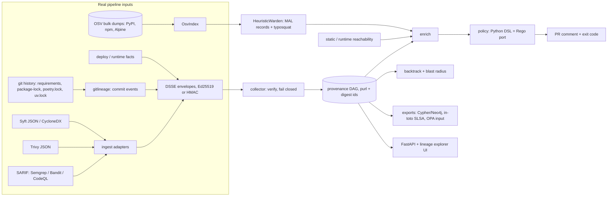

# TRACEGATE

[](https://github.com/rakshit-737/tracegate/actions/workflows/ci.yml)

[](https://rakshit-737.github.io/tracegate/)
[](LICENSE)


**Docs:** https://rakshit-737.github.io/tracegate/ (includes a [static demo](https://rakshit-737.github.io/tracegate/demo/) of the lineage explorer).

**TRACEGATE is a provenance-aware CI/CD security gate.** It merges real Syft SBOMs, Trivy scans, git history and OSV data into one signed, content-addressed provenance graph. It can then answer the question most scanners leave open: *which commit, and which PR, put this CVE in production, and what else inherits it?*

- **Gate.** Every PR gets a deterministic pass/warn/block verdict. Each reason is the graph path that produced it (commit -> dependency -> layer -> image -> service).
- **Backtrack.** Takes a CVE or package and returns the commit, PR, author and build that introduced it.
- **Blast radius.** Lists every image, service and container that inherits a vulnerable dependency or base layer.
- **Reachability triage.** A critical CVE in a package the app never imports or loads is downgraded from block to warn, with the evidence attached.
- **Fail closed.** The gate blocks on an unsigned, forged or tampered attestation, and on a missing required stage.

---

## Headline results (real public data)

All numbers below come from the committed runs in [`results/`](results/). You can reproduce them with the commands in [Reproducibility](#reproducibility).

| Question | Data | TRACEGATE | Best baseline |
| --- | --- | --- | --- |
| Finding -> introducing commit (backtrack accuracy) | 365 pinned packages over 36 historical snapshots of 3 real repos (healthchecks, netbox, pypi/warehouse) | **97.5%** (356/365) | 17.3% "last manifest commit"; 9.3% "first pickaxe mention"; 0% scanner-only |
| Cross-tool identity (Trivy finding -> Syft SBOM node) | 507 Trivy findings on 7 real official images | **100%** matched | 100% with naive `name@version`; 11.6% with raw purl string equality |
| Reachability: how many high/critical findings stay actionable | 829 high+ OSV findings across the same 36 snapshots | **704 actionable (-15.1%)** | 829 (raw scanner output) |
| Typosquat detection, PyPI (test half) | 5,952 OSV `MAL-*` names vs 4,969 legitimate packages ranked 5k-15k | P **0.84** / FPR **1.7%** (th 0.54); F1 **0.159** [95% CI 0.147-0.170] at matched FPR | Levenshtein <= 1: P 0.75 / FPR 3.3%, F1 0.153 [0.142-0.165] |
| Base-image blast radius | 7 official Alpine-3.14 images | 1 shared base layer -> 7 images / 7 services; 43 findings in that layer; each OpenSSL CVE reaches 7 services | n/a (per-image scanners report the same CVE 7 times) |
| Gate latency | real graphs | median 37 ms (healthchecks), 70 ms (netbox), 448 ms (warehouse, 184 pins), 72 ms (7-image graph, 538 nodes) | — |

What the numbers mean, stated plainly:

- **Backtracking is the strongest result.** The ground truth is `git blame --first-parent` on the pin line, which is computed independently of TRACEGATE's diff-based lineage walk. The 9 disagreements are listed in `results/lineage_real_repos.json`, and they fall into two groups:

- 3 are merge commits (`Merge pull request #1044 ...`). Blame credits the merge, while TRACEGATE credits the commit on the branch that changed the pin. Both answers can be defended.
- 6 are cases where blame credits a later commit that *rewrote the line without changing the version* (for example, `Bump boto3 ... (#4934)` re-emitted the hashes for `celery`, `jinja2` and `mako`). TRACEGATE tracks version changes, not text changes, so its answer is arguably the right one.
- **Cross-tool identity is table stakes on these images, not a win over every baseline.** A naive `name@version` join also matches all 507 findings on these images. The canonical purl only beats raw purl string equality (Syft and Trivy emit different qualifiers). Its value is that the same key merges manifest, Syft and Trivy nodes and keeps ecosystems apart, which a bare `name@version` join cannot guarantee.
- **Reachability cuts about 15% of high/critical alerts, but there is no exploitability ground truth.** On the netbox snapshots, the downgraded findings include `pycrypto`, `paramiko` and `ecdsa` pins that the app never imports. Older snapshots are analysed against HEAD sources, which is an approximation and is flagged in the output. At netbox HEAD, 6 of 45 pins are "unreached". Four of them (mkdocs*, django-rich) are correctly docs/dev-only. `tablib` is probably a miss: netbox's own code never imports it, so it is most likely loaded by django-tables2's export feature, and the `# via` data needed to see that edge is not in netbox's plain `requirements.txt`.
- **Typosquat recall is low for every detector.** This is expected: most `MAL-*` records are random names, dependency-confusion names or spam, not look-alikes of popular packages. On the subset whose advisory text says "typosquat", recall is 10.5% at the default threshold and 14.1% at matched FPR. TRACEGATE's advantage over plain Levenshtein is **half the false-positive rate for about the same F1**. It is not a big recall gain. A seeded, stratified bootstrap (1,000 resamples of the test half, `results/typosquat_*.json` -> `bootstrap`) puts the paired F1 gain at matched FPR at +0.006 [95% CI +0.001, +0.010] on PyPI and +0.0005 [0.000, +0.001] on npm: real but small. At the default threshold (th 0.54) F1 is *lower* than Levenshtein's (paired diff -0.019 [-0.024, -0.014]); that is the price of the lower FPR. On npm, all detectors are near zero recall (F1 0.005), because the npm `MAL-*` set (~109k names) is mostly spam.


### Real images: what the gate sees

| Image | Syft pkgs | Layers | Trivy findings | Matched to SBOM node | Syft/Trivy SBOM Jaccard |
| --- | ---: | ---: | ---: | ---: | ---: |
| alpine:3.14.2 | 15 | 1 | 43 | 43 | 0.93 |
| httpd:2.4.49-alpine3.14 | 36 | 5 | 99 | 99 | 0.94 |
| memcached:1.6.10-alpine3.14 | 20 | 6 | 44 | 44 | 0.90 |
| nginx:1.21.3-alpine | 45 | 6 | 105 | 105 | 0.93 |
| node:14.17.6-alpine3.14 | 417 | 4 | 90 | 90 | 0.995 |
| python:3.9.7-alpine3.14 | 51 | 5 | 83 | 83 | 0.95 |
| redis:6.2.5-alpine3.14 | 19 | 6 | 43 | 43 | 0.89 |

When the 7 images are merged into one graph, the result has 538 nodes and 556 edges. The 507 per-image Trivy rows collapse into 215 unique finding nodes (142 unique CVEs), a 2.4x de-duplication. The gate verdict is `block`.

Warden (dependency-risk) scoring of the 401 language packages flags 3. One is `npm-cli-docs`: OSV has an all-versions MAL record for that public name, and npm bundles an internal package with the same name. The other two are typosquat-heuristic false positives on legitimate packages (`ansistyles`, `uid-number`). An earlier name-only MAL lookup flagged 13 more clean packages (`chalk 2.4.1`, `debug 3.1.0`, ...). The cause was the Sept-2025 npm hijack records, which list only the trojanised versions. The fix is covered in [ADR 0006](docs/adr/0006-version-aware-malicious-package-matching.md).

### Scale (synthetic, for graph growth only)

| Services | Deps | Events | Nodes | Edges | Gate median |
| ---: | ---: | ---: | ---: | ---: | ---: |
| 10 | 50 | 41 | 104 | 562 | 0.014 s |
| 50 | 100 | 201 | 354 | 5,302 | 0.17 s |
| 100 | 200 | 401 | 704 | 20,602 | 0.55 s |
| 200 | 400 | 801 | 1,404 | 81,202 | 1.63 s |

---

## Architecture



Graph shape: `commit -introduced-> dependency -installed_in-> layer -layer_of-> image -> deployment -> container`, plus `commit -> build -> image`. Node ids are content-addressed. Dependencies are keyed by a canonical purl, so a package seen in the manifest, by Syft and by Trivy becomes **one** node, and a shared base layer is one node across every image ([ADR 0001](docs/adr/0001-content-addressed-identity.md)).

| Module | File | Notes |
| --- | --- | --- |
| Contracts, content addressing | `models.py`, `ids.py` | canonical purls, memoised |
| Signing | `signing.py` | DSSE PAE; Ed25519 (`cryptography`) or HMAC; in-toto v1 / SLSA statements |
| Collector | `collector.py` | verifies every envelope; missing or invalid provenance blocks |
| Real-tool ingest | `ingest.py` | Syft JSON, CycloneDX, Trivy JSON (unchanged tool output) |
| Git lineage | `gitlineage.py` | first-parent manifest walk, follows renames, PR numbers from subjects |
| OSV index | `osv.py` | offline, streams official zip dumps; ECOSYSTEM/SEMVER ranges; CVSS v3 |
| Typosquat / Warden | `typosquat.py`, `warden.py` | deletion-index edit distance, transposition, separator, homoglyph, suffix, combosquat; `MultiWarden` per ecosystem; `HttpWardenClient` seam |
| Reachability | `reach.py`, `enrich.py` | runtime facts first, static fallback ([ADR 0004](docs/adr/0004-reachability-runtime-first-static-fallback.md)) |
| Policy | `policy.py`, `policies/tracegate.rego` | deterministic; Rego parity checked in CI ([ADR 0003](docs/adr/0003-deterministic-policy-python-dsl-and-rego.md)) |
| Backtrack | `backtrack.py` | origin story + blast radius |
| Exports | `export.py` | Neo4j Cypher, JSON, OPA input, in-toto |
| Service | `api.py`, `ui/index.html` | FastAPI + dependency-free lineage explorer |

Reachability tiers: `imported` (AST imports and dotted strings), `entrypoint` (named in the Dockerfile, Procfile, CI or config), `transitive` (pip-compile `# via` edges, and implied framework dependencies such as `django.db.backends.postgresql` -> psycopg), `referenced` (bare string constants such as passlib's `"argon2"`), and `unreached`. Only `unreached` findings are downgraded.

---

## Quickstart

```bash
git clone https://github.com/rakshit-737/tracegate && cd tracegate
pip install -e ".[dev]"            # the core gate is stdlib-only; extras add crypto/osv/api
python -m pytest -q                # 56 tests; 4 real-data tests skip without datasets
python -m tracegate.cli demo       # the six spec scenarios
```

Gate a real image scan with Ed25519-signed provenance:

```bash
tracegate keygen ci
export TRACEGATE_KEYID=ci TRACEGATE_SIGNING_KEY=ci.key TRACEGATE_PUBKEY=ci.pub
syft  <image> -o syft-json=sbom.json
trivy image --format json -o trivy.json <image>
tracegate ingest --syft sbom.json --trivy trivy.json --commit $(git rev-parse HEAD) -o img.json
tracegate lineage . requirements.txt -o commits.json       # commit -> dependency lineage
tracegate merge commits.json img.json -o events.json
tracegate gate events.json --comment                        # exit 1 on block
tracegate backtrack events.json CVE-2023-0465
tracegate export events.json --format intoto > provenance.intoto.json
tracegate export events.json --format cypher | cypher-shell -u neo4j -p ...
```

Service and UI: run `tracegate serve` (FastAPI on :8080, lineage explorer at `/`), or `docker compose up --build` for the API plus Neo4j (localhost-only ports).

Demo scenarios (these follow the spec):

| Scenario | Outcome |
| --- | --- |
| `clean` | pass; also prints the base-layer blast radius |
| `malicious-dep` | typosquat blocked, with the commit -> dependency path |
| `cve-origin` | reachable CVE blocked; the origin story names PR #42 and 3 services |
| `unreachable` | critical CVE in a module that is never loaded -> warn |
| `tampered` | forged scan attestation -> block (fail closed) |
| `unsigned-missing` | missing stage -> block |

---

## Datasets

Nothing large is committed. `scripts/download_data.py` fetches everything into `$TRACEGATE_DATA` (default: a sibling `../../datasets/tracegate` if present, else `./data/`, which is git-ignored) and records a sha256 and a timestamp for each file in `MANIFEST.json`. Tool binaries are verified against the release checksums. The total is about 2.8 GB, of which about 1.4 GB is the Trivy vulnerability DB.

| Data | Source | Size | Licence |
| --- | --- | --- | --- |
| OSV bulk dumps: PyPI, npm, Alpine (includes ossf/malicious-packages `MAL-*`) | `osv-vulnerabilities.storage.googleapis.com` | 244 MB | per source: OSV/GHSA/PyPA data CC-BY-4.0, malicious-packages Apache-2.0 |
| Top PyPI packages (30-day downloads) | hugovk/top-pypi-packages | 1 MB | see upstream repo |
| npm high-impact list | wooorm/npm-high-impact | <1 MB | MIT |
| Git history: healthchecks, netbox, pypi/warehouse (blobless clones) | GitHub | 79 MB | BSD-3 / Apache-2.0 / Apache-2.0 |
| 7 pinned official Docker images (pulled as data, sha256-verified, **never run**) | Docker Hub | 283 MB | per image |
| Syft 1.52.0, Trivy 0.74.0 binaries + Trivy DB | anchore/syft, aquasecurity/trivy | ~1.7 GB | Apache-2.0 |

Small fixtures derived from real tool output (`tests/fixtures/alpine.syft.json`, `alpine.trivy.json`, `osv_sample.json`) keep CI independent of the downloads.

## Reproducibility

`make` is optional. Each target is a single command:

```bash
python scripts/download_data.py all      # make data   (OSV, popularity lists, tools, repos)
trivy image --download-db-only --cache-dir <data>/trivy-cache   # Trivy vuln DB (not fetched by the script)
python scripts/scan_real.py all          # make scans  (real Syft + Trivy over images and repos)
python benchmarks/typosquat_eval.py      # -> results/typosquat_{pypi,npm}.json, typosquat_pr.png
python benchmarks/lineage_eval.py --snapshots 12   # -> results/lineage_real_repos.json
python benchmarks/images_eval.py         # -> results/images_real.json
python benchmarks/scale_eval.py          # -> results/scale_synthetic.json
python -m pytest -q -m realdata          # real-data tests (need the datasets)
```

OSV dumps, popularity lists and the Trivy DB are live feeds, so a re-run on a later date can shift finding counts and typosquat numbers; the sha256 of what was used is in `MANIFEST.json`. Re-running `images_eval.py` on the same data reproduced every count in `results/images_real.json` exactly (only latency changed).

Evaluation design, including the splits, ground truth and why download counts are *not* used as a typosquat feature, is in [ADR 0005](docs/adr/0005-real-data-evaluation-design.md).

---

## Prior art and how this differs

| Tool | What it does | TRACEGATE |
| --- | --- | --- |
| Syft | SBOM generation | consumes its unmodified JSON as the build/layer stage |
| Trivy / Grype | per-artifact vuln scanning | attaches findings to shared graph nodes and adds commit lineage and blast radius |
| Sigstore / SLSA / in-toto | attestation formats and verification | emits DSSE + in-toto SLSA statements; its contribution is the queryable graph on top |
| GUAC (OpenSSF) | supply-chain metadata graph | GUAC is a large multi-service aggregator; TRACEGATE is a stdlib-only CI gate with deterministic verdicts and commit-level backtracking |
| Snyk / GitHub Advanced Security | commercial suites | open source, and gives one graph you can query across stages |
| typosquat scanners (e.g. Levenshtein-based) | name similarity | benchmarked here against a Levenshtein-1 baseline on real `MAL-*` data |

SBOMs, scanning and attestation formats are not novel. The contribution is the integration: canonical cross-tool identity, finding -> commit backtracking evaluated against git blame, and reachability-aware, fail-closed gating.

## Limitations

- **Reachability is static and at module level.** Runtime facts are supported as events, but no eBPF or `/proc/*/maps` collector ships. Historical snapshots in the lineage benchmark use HEAD sources. `gitlineage.materialize()` exists to check out per-snapshot sources, but it is not yet wired into the benchmark.
- **The 15% reduction has no false-negative audit.** There is no public ground truth for "exploitable in this app".
- **Lineage covers `requirements*.txt`, `package-lock.json`, `poetry.lock` and `uv.lock`.** Go modules, Cargo and yarn/pnpm locks are not parsed yet. The real-repo lineage benchmark numbers are for pip manifests only.
- **Signing uses Ed25519 or HMAC keys, not Sigstore keyless.** There is no Rekor transparency log.
- **Warden is a stand-in.** The HTTP contract to the real Warden service (`GET /score`) is assumed.
- **Typosquat recall is low in absolute terms** (see above). Treat it as one signal, not a malware detector.
- **SAST comes in as SARIF 2.1.0** (`tracegate ingest --sarif`, tested on Bandit-style fixtures). SAST findings are attached to files, not to dependencies, so reachability does not apply to them.
- Image deployments in the image benchmark are synthetic (one service per image).

## Roadmap

- Per-snapshot source materialisation in the reachability benchmark; eBPF / `sys.modules` runtime collector.
- Lock-file lineage for Go modules, Cargo and yarn/pnpm.
- Sigstore keyless signing + Rekor inclusion proofs.
- Neo4j live adapter (currently Cypher export) and a React lineage explorer.
- EPSS-based prioritisation and a GitHub App for PR comments.

## Safety

TRACEGATE is a defensive, lab-only tool. It reads pipeline metadata that you produce. Images are pulled as tarballs, unpacked with path and link sanitisation, and catalogued; they are never executed. No malware is downloaded. Malicious packages are known only by name and OSV record. Nothing in this repo scans third-party systems. See [THREAT_MODEL.md](THREAT_MODEL.md) and [SECURITY.md](SECURITY.md).

## Contributing and licence

See [CONTRIBUTING.md](CONTRIBUTING.md) and [CHANGELOG.md](CHANGELOG.md). Design decisions are in [docs/adr](docs/adr). MIT licensed; see [LICENSE](LICENSE).
