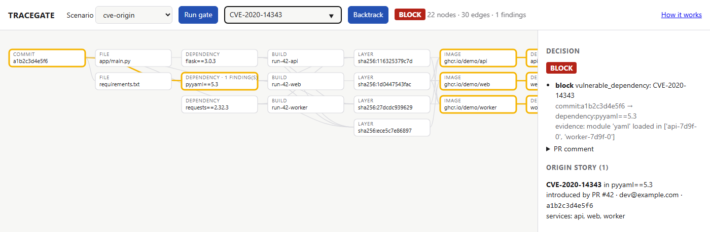
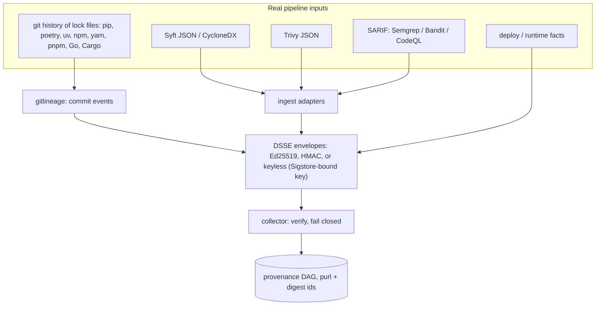
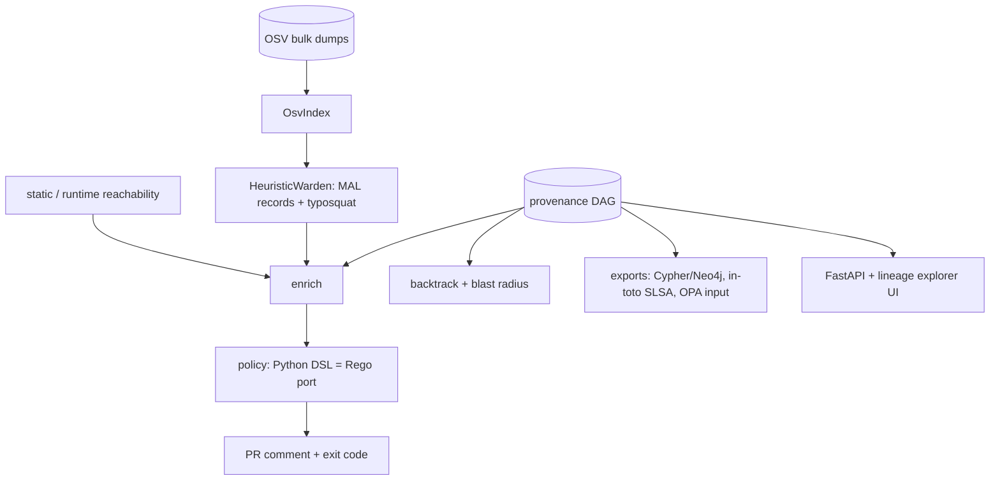

# TRACEGATE

**Which commit, and which PR, put this CVE in production?** TRACEGATE answers from the lock-file history, inside a signed, fail-closed CI gate.

[](https://github.com/rakshit-737/tracegate/actions/workflows/ci.yml)

[](https://rakshit-737.github.io/tracegate/)
[](LICENSE)


**Contribution.** TRACEGATE applies version-aware attribution to lock-file history: it credits each scanner finding to the commit whose diff introduced that exact (package, version) pair, not to whoever last rewrote the line, and it does this inside a fail-closed gate that verifies signed provenance for every pipeline stage. ([How it works](https://rakshit-737.github.io/tracegate/how-it-works/#7-version-diff-vs-line-blame) · [Evaluation](https://rakshit-737.github.io/tracegate/evaluation/))

<!-- results:hero -->
| | |
| --- | --- |
| **Agreement with `git blame`** | 92.4% of 3,969 vulnerable (snapshot, pin) pairs in 11 repos and 4 ecosystems (one-version-per-name readers on the same data: 88.5%); a package-specific `git log -S` pickaxe: 89.6%. Blame shares the lock-file reader, so this is agreement, not correctness. |
| **Commit-message oracle** | At the labelled commit TRACEGATE is right on 458/458 by construction, as is `git blame` (458/458). At the last later snapshot still pinning the version: TRACEGATE 436/436 (one-sided 95% exact lower bound 99.3%), `git blame` 419/436 (96.1%). The oracle tests version tracking under line rewrites, not attribution independent of the lock-file reader. |
| **Typosquat (PyPI, supporting signal)** | F1 0.133 at the dev-tuned threshold, 0.153 FPR-matched, vs Damerau-1 0.147; recall is low for every detector. |

Backtracking: run [37091106360](https://github.com/rakshit-737/tracegate/actions/runs/37091106360); oracle: run [37091106360](https://github.com/rakshit-737/tracegate/actions/runs/37091106360); typosquat: run [37003433022](https://github.com/rakshit-737/tracegate/actions/runs/37003433022).
<!-- /results:hero -->

[](https://rakshit-737.github.io/tracegate/demo/)

**Docs:** https://rakshit-737.github.io/tracegate/ · [live demo](https://rakshit-737.github.io/tracegate/demo/) · [how it works](https://rakshit-737.github.io/tracegate/how-it-works/)

## Try it in 60 seconds

1. **Zero install:** open the [live demo](https://rakshit-737.github.io/tracegate/demo/). The `cve-origin` scenario loads with a BLOCK verdict; type `CVE-2020-14343` and press Enter to see the origin story (PR #42) and the blast radius.
2. **From source** (v1.1.0 or later; do not `pip install tracegate`: that PyPI name belongs to an unrelated project):

   ```bash
   python -m venv .venv && . .venv/bin/activate        # Windows: .venv\Scripts\activate (Git Bash: . .venv/Scripts/activate)
   pip install "git+https://github.com/rakshit-737/tracegate@v1.1.1"
   tracegate demo                                      # six scenarios, about 2 seconds
   tracegate synth cve-origin ev.json
   tracegate --demo backtrack ev.json CVE-2020-14343   # "introduced_by": {"pr": 42, ...}
   tracegate --demo gate ev.json --comment             # "## TRACEGATE: BLOCK", exit 1
   ```

   `--demo` (accepted before or after the subcommand) trusts the public demo key. Without a configured key the gate refuses to run (exit 2). The v1.0.0 release (wheel and `:1.0.0` image) predates both: it trusts the demo key implicitly (fail-open) and is superseded by v1.1.0.
3. **Container (build from source):** `docker build -t tracegate . && docker run --rm -p 127.0.0.1:8080:8080 tracegate`, then open http://127.0.0.1:8080 and run a scenario. Or pull `ghcr.io/rakshit-737/tracegate:1.1.1` (verify it as shown in [SECURITY.md](SECURITY.md)); the `:1.0.0` image is the superseded fail-open build.

**TRACEGATE is a provenance-aware CI/CD security gate.** It merges real Syft SBOMs, Trivy scans, git history and OSV data into one signed, content-addressed provenance graph, then answers the question most scanners leave open: *which commit, and which PR, put this CVE in production, and what else inherits it?*

- **Gate.** Every PR gets a deterministic pass/warn/block verdict. Each reason is the graph path that produced it (commit -> dependency -> layer -> image -> service).
- **Backtrack.** Takes a CVE or package and returns the commit, PR, author and build that introduced the vulnerable version.
- **Blast radius.** Lists every image, service and container that inherits a vulnerable dependency or base layer.
- **Fail closed.** The gate blocks on an unsigned, forged, tampered or malformed attestation, on a missing required stage, and on a HIGH/CRITICAL scanner finding it cannot attribute to an SBOM node; it refuses to run with no trust root. In CI the signing key can be bound to the workflow identity with Sigstore keyless signing.
- **Reachability triage.** A critical CVE in a package the app never imports or loads is downgraded from block to warn, with the evidence attached, but only when the manifest records dependency edges (pip-compile `# via`); an audit of the earlier downgrades is in the Evaluation.

---

## Headline results (real public data)

Every number below is rendered from the committed JSON in [`results/`](results/) by `scripts/render_results.py`, and CI fails if a table and its file disagree. Each file names the Actions run that produced it; the [Evaluation](https://rakshit-737.github.io/tracegate/evaluation/) page lists which run produced which file, with the methodology, every table and interval. Commands: [Reproduce](https://rakshit-737.github.io/tracegate/reproduce/).

<!-- results:headline -->
| Question | Data | TRACEGATE | Baselines and ablations |
| --- | --- | --- | --- |
| Finding -> introducing commit, agreement with `git blame --first-parent` | 3,969 vulnerable (snapshot, pin) pairs, 132 snapshots of 11 repos, 4 ecosystems | **92.4%** [Wilson 91.5-93.2; repo-clustered 82.7-99.5]; old one-version readers on the same data 88.5% | package-specific `git log -S` 89.6%; version-line `git log -S` 72.2%; last manifest commit 13.8%; first mention 13.1% |
| ... per ecosystem | pip 362 / Go 328 / Cargo 523 / npm (yarn, pnpm) 2,756 pairs | 97.8% / 99.7% / 99.2% / 89.5% | package-specific `git log -S`: 100.0% / 100.0% / 99.0% / 85.2% |
| Finding -> introducing commit, **commit-message oracle** (4,532 labelled bumps, reverts and re-bumps; 458 sampled) | at the labelled commit / at the last later snapshot still pinning it | 458/458 (by construction) / **436/436** (one-sided 95% exact >= 99.3%) | `git blame` 458/458 / 419/436 (96.1%); package-specific `git log -S` 403/436 later; old one-version readers 13/67 on the multi-version stratum; no recency rule 0/40 on reverts and re-bumps |
| Reachability: high/critical findings left actionable | 887 high+ OSV findings, 36 snapshots of 3 Python repos, own sources | 887 (0 downgraded): the previous rule's downgrades were audited and 17/17 pins were loaded (exact 95% 80.5-100.0), so without recorded dependency edges nothing is downgraded now | 887 (raw scanner output) |
| Typosquat, PyPI (hash split, test half) | 5,964 OSV `MAL-*` names vs 4,973 packages ranked 5k-15k | F1 0.133 at the dev-tuned default (FPR 1.7%); 0.153 FPR-matched to Damerau-1 (paired F1 difference [+0.002, +0.011]) | Damerau-1 0.147; typomania/TypoGard port 0.125; our pypi-scan port 0.112 |
| Keyless signing | dev build `cfd215e` wheel + sdist ([evidence](results/sigstore_evidence.json)); v1.1.0 release bundles on the release page | signed with GitHub OIDC, verified, Rekor entries checked | - |
| Admission | kind cluster, 3 images ([decisions](results/kind_admission.json)) | admits only the image with a valid signature and complete signed provenance | cosign alone would admit the third image |
| Gate latency (median per repo) | real lineage graphs | pip 7-70 ms, Go 283-304 ms, Cargo 40-129 ms, npm (yarn, pnpm) 126-483 ms; max 1619 ms (per snapshot graph) | - |
<!-- /results:headline -->

What the numbers mean, stated plainly:

- **Agreement with `git blame` is not correctness, and the sampled disagreements are blame's.** Blame and the pickaxes credit whoever last wrote the pin line. On pip and Go TRACEGATE disagrees with them on 9 pairs; those, plus a uniform random sample of 50 of the 293 Cargo and npm disagreements, were read against the diffs. In 59 of 59 the commit blame names already pinned the version at its parent: merges, pip-compile rewrites that lower-cased names, the Yarn 4 and pnpm format migrations, unrelated bumps that re-sorted lines. TRACEGATE's commit made the version appear in 59/59 (Wilson 95% 94-100%). The reading rule is TRACEGATE's own definition of "introducing commit" (newest commit whose diff makes the pair appear), so this shows the disagreements are line rewrites, not that the lock-file reader is right where all methods agree.
- **A package-specific `git log -S` is a strong baseline.** With a token that names the package (Cargo's `name`/`version` pair, yarn's block header plus version), the pickaxe ties TRACEGATE on Cargo (519/523 vs 518/523; exact McNemar p = 1.00) and on Go (327/328 vs 328/328; p = 1.00), and agrees with blame more often on pip (362/362 vs 354/362; p = 0.008). On npm (yarn, pnpm) TRACEGATE agrees more often (89.5% vs 85.2%; 360 : 242 discordant, p = 1.7e-06), but the repo-clustered interval of that difference includes 0. The v1.1.0 headline gap on Cargo (95.0% vs 54.7%) came from a version-line token that matches every crate at that version; it is kept as the `version line` column and is not a fair baseline.
- **The multi-version readers matter on npm and Cargo.** On the same clones and OSV data, the old one-version-per-name readers agree on 88.5% of their pairs and the new readers on 92.4% (npm 83.6% -> 89.5%, Cargo 95.0% -> 99.2%); the new readers also see more vulnerable pins (3,969 vs 3,218), because second copies of a package are now matched against OSV. vue-core stays the weakest repository by agreement; its disagreements are mostly merges of `main` into `minor` and lock-file format migrations that blame credits.
- **The commit-message oracle shows version tracking under rewrites.** At the labelled commit TRACEGATE is right by construction (458/458) and so is blame (458/458). At the last later snapshot TRACEGATE keeps 436/436 (one-sided 95% exact lower bound 99.3%) and blame 419/436; 16 of blame's 17 misses are in mastodon (the Yarn-4 rewrite and an exact-versions rewrite) and vue-core (merges and re-sorting updates), so the repo-clustered interval of the difference starts at 0. The oracle can fail: the old readers score 13/67 on the multi-version stratum and attribution without the recency rule 0/40 on reverts and re-bumps.
- **Static reachability gave no useful triage on these repositories.** All 17 pins (45 findings) that the per-snapshot run downgraded turned out to be loaded, as dependencies of packages the apps import (false-`unreached` rate 17/17, exact 95% interval 80.5-100%); their requirement files record no dependency edges. The gate now downgrades only when the manifest records `# via` edges, which on these 36 snapshots means never.
- **Typosquat recall is low for every detector** (most `MAL-*` names are spam or dependency confusion). The test sets are mostly malicious (PyPI 55%, npm 96%), so precision there is not deployment precision: at a 1% base rate TRACEGATE's precision would be about 3-4%. On a time split (tune before 2025, test after) the top-5k detectors roughly halve (TRACEGATE F1 0.059 at the dev-tuned default, 0.083 FPR-matched, vs Damerau-1 0.066). On RubyGems the 14-name difflib check beats every top-5k detector, TRACEGATE included (F1 0.213 vs 0.075), because the `MAL-*` names there are floods of variants of a few top gems; on crates.io and NuGet no detector is useful.

### Real images: what the gate sees

<!-- results:images -->
| Image | Syft pkgs | Layers | Trivy findings | matched, naive name@version | matched, raw purl string | matched, canonical purl | Syft/Trivy SBOM Jaccard |
| --- | ---: | ---: | ---: | ---: | ---: | ---: | ---: |
| alpine:3.14.2 | 14 | 1 | 43 | 43 | 0 | 43 | 1.00 |
| httpd:2.4.49-alpine3.14 | 49 | 5 | 99 | 99 | 0 | 99 | 0.97 |
| memcached:1.6.10-alpine3.14 | 33 | 6 | 44 | 44 | 0 | 44 | 0.95 |
| nginx:1.21.3-alpine | 56 | 6 | 105 | 105 | 0 | 105 | 1.00 |
| node:14.17.6-alpine3.14 | 430 | 4 | 94 | 94 | 51 | 94 | 1.00 |
| python:3.9.7-alpine3.14 | 64 | 5 | 83 | 83 | 12 | 83 | 0.97 |
| redis:6.2.5-alpine3.14 | 32 | 6 | 43 | 43 | 0 | 43 | 0.94 |

All 511 Trivy rows: naive 100.0%, raw purl 12.3%, canonical 100.0%. Merged graph: 535 nodes, 637 edges; 219 unique finding nodes (146 CVEs), a 2.33x de-duplication; verdict `block`; 0 unattributed findings. Source: `results/images_real.json`, run [37088867445](https://github.com/rakshit-737/tracegate/actions/runs/37088867445).
<!-- /results:images -->

Warden (dependency-risk) scoring of the 401 language packages in these images flags 3. One is `npm-cli-docs`: OSV has an all-versions MAL record for that public name, and npm bundles an internal package with the same name. The other two are typosquat-heuristic false positives on legitimate packages (`ansistyles`, `uid-number`). The cause of an earlier batch of 13 false MAL flags (Sept-2025 npm hijack records that list only the trojanised versions) is covered in [ADR 0006](docs/adr/0006-version-aware-malicious-package-matching.md).

### Scale (synthetic, for graph growth only)

<!-- results:scale -->
| Services | Deps | Events | Nodes | Edges | Gate median |
| ---: | ---: | ---: | ---: | ---: | ---: |
| 10 | 50 | 41 | 104 | 562 | 0.004 s |
| 50 | 100 | 201 | 354 | 5,302 | 0.038 s |
| 100 | 200 | 401 | 704 | 20,602 | 0.132 s |
| 200 | 400 | 801 | 1,404 | 81,202 | 0.622 s |

Synthetic data; source `results/scale_synthetic.json`, run [37088867445](https://github.com/rakshit-737/tracegate/actions/runs/37088867445).
<!-- /results:scale -->

---

## Architecture

**1. Ingest, sign, verify**



**2. Enrich, decide, query**



Graph shape: `commit -introduced-> dependency -installed_in-> layer -layer_of-> image -> deployment -> container`, plus `commit -> build -> image`. Node ids are content-addressed. Dependencies are keyed by a canonical purl, so a package seen in the manifest, by Syft and by Trivy becomes **one** node, and a shared base layer is one node across every image ([ADR 0001](docs/adr/0001-content-addressed-identity.md)).

| Module | File | Notes |
| --- | --- | --- |
| Contracts, content addressing | `models.py`, `ids.py` | canonical purls, memoised |
| Signing | `signing.py` | DSSE PAE; Ed25519 (`cryptography`) or HMAC; in-toto v1 / SLSA statements |
| Collector | `collector.py` | verifies every envelope; missing or invalid provenance blocks |
| Real-tool ingest | `ingest.py` | Syft JSON, CycloneDX, Trivy JSON (unchanged tool output) |
| Git lineage | `gitlineage.py` | first-parent manifest walk, follows renames, PR numbers from subjects |
| OSV index | `osv.py` | offline, streams official zip dumps; ECOSYSTEM/SEMVER ranges; CVSS v3 |
| Typosquat / Warden | `typosquat.py`, `warden.py` | deletion-index edit distance, transposition, separator, homoglyph, suffix, combosquat; `MultiWarden` per ecosystem; `WardenApiClient` for the real Warden service |
| Reachability | `reach.py`, `enrich.py` | runtime facts first, static fallback ([ADR 0004](docs/adr/0004-reachability-runtime-first-static-fallback.md)) |
| Policy | `policy.py`, `policies/tracegate.rego` | deterministic; Rego parity checked in CI ([ADR 0003](docs/adr/0003-deterministic-policy-python-dsl-and-rego.md)) |
| Backtrack | `backtrack.py` | origin story + blast radius |
| Exports | `export.py` | Neo4j Cypher, JSON, OPA input, in-toto |
| Service | `api.py`, `ui/index.html` | FastAPI + dependency-free lineage explorer |

Reachability tiers: `imported` (AST imports and dotted strings), `entrypoint` (named in the Dockerfile, Procfile, CI or config), `transitive` (pip-compile `# via` edges, and implied framework dependencies such as `django.db.backends.postgresql` -> psycopg), `referenced` (bare string constants such as passlib's `"argon2"`), `unreached` (none of these, in a manifest that records dependency edges) and `unknown` (none of these, but the manifest records no edges). Only `unreached` findings are downgraded.

---

## Development

```bash
git clone https://github.com/rakshit-737/tracegate && cd tracegate
pip install -e ".[dev]"            # the core gate is stdlib-only; extras add crypto/osv/api
python -m pytest -q                # about 100 tests; real-data tests skip without datasets
python -m tracegate.cli demo       # the six spec scenarios
```

Gate a real image scan with Ed25519-signed provenance:

```bash
tracegate keygen ~/.tracegate/ci          # keep keys outside the repo; the .key is written 0600
export TRACEGATE_KEYID=ci TRACEGATE_SIGNING_KEY=~/.tracegate/ci.key TRACEGATE_PUBKEY=~/.tracegate/ci.pub
syft  <image> -o syft-json=sbom.json
trivy image --format json -o trivy.json <image>
tracegate ingest --syft sbom.json --trivy trivy.json --commit $(git rev-parse HEAD) -o img.json
tracegate lineage . requirements.txt -o commits.json       # run inside an app repo with a pinned manifest
tracegate merge commits.json img.json -o events.json
tracegate gate events.json --comment                        # exit 1 on block
tracegate backtrack events.json CVE-2023-0465
tracegate export events.json --format intoto > provenance.intoto.json
tracegate export events.json --format cypher | cypher-shell -u neo4j -p ...
```

Service and UI: `tracegate --demo serve` starts the API with the lineage explorer at http://127.0.0.1:8080 and the built-in scenarios (public demo key). For a real gate give it a trust root, for example `TRACEGATE_KEYID=ci TRACEGATE_PUBKEY=~/.tracegate/ci.pub tracegate serve`; with no trust root it refuses to start (exit 2). Set `TRACEGATE_API_TOKEN` before exposing it beyond localhost. `NEO4J_PASSWORD=... TRACEGATE_PUBKEY_FILE=~/.tracegate/ci.pub docker compose up --build` adds Neo4j (localhost-only ports); compose refuses to start without `NEO4J_PASSWORD`.

Demo scenarios (these follow the spec):

| Scenario | Outcome |
| --- | --- |
| `clean` | pass; also prints the base-layer blast radius |
| `malicious-dep` | typosquat blocked, with the commit -> dependency path |
| `cve-origin` | reachable CVE blocked; the origin story names PR #42 and 3 services |
| `unreachable` | critical CVE in a module that is never loaded -> warn |
| `tampered` | forged scan attestation -> block (fail closed) |
| `unsigned-missing` | missing stage -> block |

---

## Datasets

Nothing large is committed. `scripts/download_data.py` fetches everything into `$TRACEGATE_DATA` (default: a sibling `../../datasets/tracegate` if present, else `./data/`, which is git-ignored) and records a sha256, size and fetch time for each file, and the head commit of each clone, in `MANIFEST.json`; each benchmark leg copies that manifest into `results/` stamped with its run. `download_data.py repos --pin-from results/data_manifest.json` checks out the exact commits a committed run used. Tool binaries are verified against the vendors' checksum files.

<!-- results:datasets -->
| Data | Used by | Source | Size | Fetched (UTC) | sha256 / commit | Licence or terms |
| --- | --- | --- | ---: | --- | --- | --- |
| `osv/Alpine-all.zip` | backtracking, oracle (run 37091106360) | osv-vulnerabilities.storage.googleapis.com/Alpine/all.zip | 4.0 MB | 2026-10-03T02:49 | `c3a745816d2c` | per source, mostly CC-BY-4.0 (OSV, GHSA, PyPA, Go); `MAL-*` records from ossf/malicious-packages, Apache-2.0 |
| `osv/Go-all.zip` | backtracking, oracle (run 37091106360) | osv-vulnerabilities.storage.googleapis.com/Go/all.zip | 12.0 MB | 2026-10-03T02:49 | `77bb6a0cb7bc` | per source, mostly CC-BY-4.0 (OSV, GHSA, PyPA, Go); `MAL-*` records from ossf/malicious-packages, Apache-2.0 |
| `osv/NuGet-all.zip` | backtracking, oracle (run 37091106360) | osv-vulnerabilities.storage.googleapis.com/NuGet/all.zip | 2.5 MB | 2026-10-03T02:49 | `a58050f8574f` | per source, mostly CC-BY-4.0 (OSV, GHSA, PyPA, Go); `MAL-*` records from ossf/malicious-packages, Apache-2.0 |
| `osv/PyPI-all.zip` | backtracking, oracle (run 37091106360) | osv-vulnerabilities.storage.googleapis.com/PyPI/all.zip | 35.4 MB | 2026-10-03T02:49 | `7c3a5ff9e05d` | per source, mostly CC-BY-4.0 (OSV, GHSA, PyPA, Go); `MAL-*` records from ossf/malicious-packages, Apache-2.0 |
| `osv/RubyGems-all.zip` | backtracking, oracle (run 37091106360) | osv-vulnerabilities.storage.googleapis.com/RubyGems/all.zip | 5.0 MB | 2026-10-03T02:49 | `11454ea786ae` | per source, mostly CC-BY-4.0 (OSV, GHSA, PyPA, Go); `MAL-*` records from ossf/malicious-packages, Apache-2.0 |
| `osv/crates.io-all.zip` | backtracking, oracle (run 37091106360) | osv-vulnerabilities.storage.googleapis.com/crates.io/all.zip | 3.5 MB | 2026-10-03T02:49 | `a461c7e74e7a` | per source, mostly CC-BY-4.0 (OSV, GHSA, PyPA, Go); `MAL-*` records from ossf/malicious-packages, Apache-2.0 |
| `osv/npm-all.zip` | backtracking, oracle (run 37091106360) | osv-vulnerabilities.storage.googleapis.com/npm/all.zip | 217.4 MB | 2026-10-03T02:49 | `303a96ffacce` | per source, mostly CC-BY-4.0 (OSV, GHSA, PyPA, Go); `MAL-*` records from ossf/malicious-packages, Apache-2.0 |
| `popular/npm-high-impact-top.js` | backtracking, oracle (run 37091106360) | raw.githubusercontent.com/wooorm/npm-high-impact/main/lib/top.js | 0.4 MB | 2026-10-03T02:49 | `bbc16e783283` | wooorm/npm-high-impact, MIT |
| `popular/top-pypi-packages.min.json` | backtracking, oracle (run 37091106360) | hugovk.dev/top-pypi-packages/top-pypi-packages.min.json | 0.8 MB | 2026-10-03T02:49 | `55fee05ed02b` | hugovk/top-pypi-packages (no licence file; public BigQuery download counts) |
| `repos/alacritty` | backtracking, oracle (run 37091106360) | github.com/alacritty/alacritty.git | blobless clone | 2026-10-03T02:50 | `d692748d3f61` | Apache-2.0 |
| `repos/bat` | backtracking, oracle (run 37091106360) | github.com/sharkdp/bat.git | blobless clone | 2026-10-03T02:50 | `4608fc959aa8` | MIT OR Apache-2.0 |
| `repos/caddy` | backtracking, oracle (run 37091106360) | github.com/caddyserver/caddy.git | blobless clone | 2026-10-03T02:50 | `ac834b5dc70a` | Apache-2.0 |
| `repos/excalidraw` | backtracking, oracle (run 37091106360) | github.com/excalidraw/excalidraw.git | blobless clone | 2026-10-03T02:50 | `ed10ac7dca7e` | MIT |
| `repos/healthchecks` | backtracking, oracle (run 37091106360) | github.com/healthchecks/healthchecks.git | blobless clone | 2026-10-03T02:49 | `e566e1c40099` | BSD-3-Clause |
| `repos/hugo` | backtracking, oracle (run 37091106360) | github.com/gohugoio/hugo.git | blobless clone | 2026-10-03T02:50 | `6b3ba3a7e22a` | Apache-2.0 |
| `repos/mastodon` | backtracking, oracle (run 37091106360) | github.com/mastodon/mastodon.git | blobless clone | 2026-10-03T02:51 | `73fe2b73467a` | AGPL-3.0 |
| `repos/netbox` | backtracking, oracle (run 37091106360) | github.com/netbox-community/netbox.git | blobless clone | 2026-10-03T02:49 | `251458b89a5e` | Apache-2.0 |
| `repos/ripgrep` | backtracking, oracle (run 37091106360) | github.com/BurntSushi/ripgrep.git | blobless clone | 2026-10-03T02:50 | `3fce3b5bb023` | Unlicense OR MIT |
| `repos/vue-core` | backtracking, oracle (run 37091106360) | github.com/vuejs/core.git | blobless clone | 2026-10-03T02:51 | `4ab865a848a1` | MIT |
| `repos/warehouse` | backtracking, oracle (run 37091106360) | github.com/pypi/warehouse.git | blobless clone | 2026-10-03T02:50 | `81b91d6b8199` | Apache-2.0 |
| `osv/Go-all.zip` | typosquat (run 37003433022) | osv-vulnerabilities.storage.googleapis.com/Go/all.zip | 12.0 MB | 2026-10-02T11:52 | `daba95c43d1d` | per source, mostly CC-BY-4.0 (OSV, GHSA, PyPA, Go); `MAL-*` records from ossf/malicious-packages, Apache-2.0 |
| `osv/PyPI-all.zip` | typosquat (run 37003433022) | osv-vulnerabilities.storage.googleapis.com/PyPI/all.zip | 35.3 MB | 2026-10-02T11:52 | `f2248ff61726` | per source, mostly CC-BY-4.0 (OSV, GHSA, PyPA, Go); `MAL-*` records from ossf/malicious-packages, Apache-2.0 |
| `osv/RubyGems-all.zip` | typosquat (run 37003433022) | osv-vulnerabilities.storage.googleapis.com/RubyGems/all.zip | 5.0 MB | 2026-10-02T11:52 | `b4f202bd02af` | per source, mostly CC-BY-4.0 (OSV, GHSA, PyPA, Go); `MAL-*` records from ossf/malicious-packages, Apache-2.0 |
| `osv/crates.io-all.zip` | typosquat (run 37003433022) | osv-vulnerabilities.storage.googleapis.com/crates.io/all.zip | 3.5 MB | 2026-10-02T11:52 | `cd0cdc315668` | per source, mostly CC-BY-4.0 (OSV, GHSA, PyPA, Go); `MAL-*` records from ossf/malicious-packages, Apache-2.0 |
| `osv/npm-all.zip` | typosquat (run 37003433022) | osv-vulnerabilities.storage.googleapis.com/npm/all.zip | 217.3 MB | 2026-10-02T11:52 | `d5432a4ae379` | per source, mostly CC-BY-4.0 (OSV, GHSA, PyPA, Go); `MAL-*` records from ossf/malicious-packages, Apache-2.0 |
| `popular/crates-top.json` | typosquat (run 37003433022) | crates.io/api/v1/crates | 0.5 MB | 2026-10-02T11:54 | `3e53adbbe87d` | crates.io API (names and download counts; crates.io data access policy) |
| `popular/nuget-top.json` | typosquat (run 37003433022) | azuresearch-usnc.nuget.org/query | 0.2 MB | 2026-10-02T11:58 | `e85f38327093` | NuGet search API (names and download counts; nuget.org terms of use) |
| `popular/rubygems-top.json` | typosquat (run 37003433022) | packages.ecosyste.ms/api/v1/registries/rubygems.org/packages | 0.5 MB | 2026-10-02T11:58 | `a0212eace429` | packages.ecosyste.ms (data CC BY-SA 4.0) |
| `bin/syft_1.52.0_linux_amd64.tar.gz` | images (run 37088867445) | github.com/anchore/syft/releases/download/v1.52.0/syft_1.52.0_linux_amd64.tar.gz | 29.3 MB | 2026-10-03T02:10 | `caeedb81fb04` | anchore/syft release, Apache-2.0 |
| `bin/trivy_0.74.0_Linux-64bit.tar.gz` | images (run 37088867445) | github.com/aquasecurity/trivy/releases/download/v0.74.0/trivy_0.74.0_Linux-64bit.tar.gz | 50.4 MB | 2026-10-03T02:10 | `2ae6fe3ee734` | aquasecurity/trivy release, Apache-2.0 |

Rendered from `results/data_manifest.json`, `data_manifest_typosquat.json` and `data_manifest_images.json`; the 7 Docker images are pulled by tag and sha256-verified by `scripts/pull_image.py` and never run. The Trivy vulnerability DB is a live feed and its version is not pinned.
<!-- /results:datasets -->

Small fixtures derived from real tool output (`tests/fixtures/alpine.syft.json`, `alpine.trivy.json`, `osv_sample.json`) keep CI independent of the downloads.

## Reproducibility

The full-data runs execute in the `benchmarks` workflow (`gh workflow run benchmarks.yml`, inputs choose the legs); the [Reproduce](https://rakshit-737.github.io/tracegate/reproduce/) page lists every command, its output file and its runtime on the runner. Locally, each step is a single command:

```bash
python scripts/download_data.py osv && python scripts/download_data.py popular
python scripts/download_data.py repos --pin-from results/data_manifest.json   # the committed run's commits
python benchmarks/lineage_eval.py --snapshots 12                  # -> results/lineage_real_repos.json
python benchmarks/lineage_eval.py --snapshots 12 --single-version # -> ..._single_version.json (old readers)
python benchmarks/lineage_eval.py --oracle-only                   # -> results/lineage_bot_bump_oracle.json
python benchmarks/lineage_eval.py --snapshots 12 --materialize --repos healthchecks netbox warehouse
python benchmarks/adjudicate.py --evidence && python benchmarks/reach_audit.py --evidence
python benchmarks/typosquat_eval.py --eco PyPI npm RubyGems crates.io NuGet   # add --split time
python scripts/download_data.py tools && python scripts/scan_real.py images && python benchmarks/images_eval.py
python benchmarks/scale_eval.py
python scripts/render_results.py --write   # re-render every results table in README.md and docs/
```

OSV dumps, popularity lists and the Trivy DB are live feeds, so a re-run on a later date can shift finding counts and typosquat numbers; the sha256 of what each run used is in its `results/data_manifest*.json`.

Evaluation design, including the splits, the references and why download counts are *not* used as a typosquat feature, is in [ADR 0005](docs/adr/0005-real-data-evaluation-design.md).

---

## Prior art and how this differs

| Work | What it does | TRACEGATE |
| --- | --- | --- |
| Syft | SBOM generation | consumes its unmodified JSON as the build/layer stage |
| Trivy / Grype | per-artifact vuln scanning | attaches findings to shared graph nodes and adds commit lineage and blast radius |
| Sigstore / SLSA / in-toto | attestation formats and verification | emits DSSE + in-toto SLSA statements; its contribution is the queryable graph on top |
| GUAC (OpenSSF) | supply-chain metadata graph | GUAC is a large multi-service aggregator; TRACEGATE is a stdlib-only CI gate with deterministic verdicts and commit-level backtracking |
| Snyk / GitHub Advanced Security | commercial suites | open source, and gives one graph you can query across stages |
| SZZ (Śliwerski, Zimmermann and Zeller, MSR 2005) and its variants: AG-SZZ (Kim et al., ASE 2006) skips cosmetic changes, MA-SZZ (da Costa et al., IEEE TSE 2017) skips meta-changes such as merges | find bug-introducing commits by blaming the lines a fix changed | a different question (which commit introduced a dependency *version*) on lock files, where line blame suffers the same cosmetic and meta-change failures; TRACEGATE compares (package, version) pairs instead of lines. `git blame` and two `git log -S` pickaxes are its line baselines |
| Rosa et al., developer-informed SZZ oracle (ICSE 2021); Lyu et al., SZZ on the Linux kernel (IEEE TSE; arXiv 2308.05060) | evaluate SZZ implementations against labels from developers / commit messages | the bot-bump oracle takes the same approach: labels from commit messages |
| typomania / TypoGard (Taylor et al., NSS 2020), pypi-scan | name similarity | original typomania and TypoGard code run on the same splits in CI (port agreement 98.99-100%); pypi-scan is our port (see Evaluation) |

SBOMs, scanning, attestation formats and line-based attribution are not novel. The contribution is applying version-aware attribution, diffing (package, version) pairs rather than lines, to lock-file history, inside a fail-closed, signature-verified CI gate. Cross-tool identity, reachability and typosquat scoring are supporting components.

## Limitations

- **The reference is line blame, and the oracle shares the reader.** Agreement with `git blame` is not correctness; the commit-message oracle is right for TRACEGATE by construction at the labelled commit and tests version tracking under rewrites at later snapshots, not attribution independent of the lock-file reader. Disagreements were adjudicated for a sample only (Evaluation).
- **Only as good as the lock-file reader.** The readers keep every version of a name (yarn, pnpm, package-lock, Cargo, poetry, uv). go.sum is used as published (highest version per module); go.mod is authoritative for Go. Unusual layouts (non-pretty-printed package-lock v2/v3) fall back to a JSON reader without line numbers, so blame and the pickaxes cannot run on them.
- **Static reachability fires only with dependency edges.** Without pip-compile `# via` annotations the gate cannot tell a transitive dependency of an imported package from an unused one, so it no longer downgrades there. An audit of every earlier downgrade found all of them loaded (Evaluation). Dynamic imports, plugins loaded by name from settings and C-extension loading stay invisible, and the sources are written by the PR under review, so static downgrades must not be trusted on untrusted PRs. No eBPF or `/proc/*/maps` runtime collector ships.
- **Keyless signing covers the CI key, not each envelope.** CI signs an ephemeral Ed25519 public key with Sigstore (Fulcio + Rekor) and the gate verifies that bundle with `cosign`; envelopes themselves are Ed25519. The kind admission demo is a gate step before `kubectl apply`, not an in-cluster validating webhook.
- **Warden integration is contract-tested only.** `WardenApiClient` follows the real Warden `POST /api/v1/scans` schema, but no end-to-end run against a live Warden is in CI; offline results use `HeuristicWarden`.
- **Typosquat recall is low in absolute terms** (see above). Treat it as one signal, not a malware detector.
- **SAST comes in as SARIF 2.1.0** (`tracegate ingest --sarif`, tested on Bandit-style fixtures). SAST findings are attached to files, not to dependencies, so reachability does not apply to them.
- **Samples and clustering.** The oracle scores at most 40 cases per repository and stratum (uniform random, seed 0); exact bounds treat cases as independent, and repository clustering would widen them. Image deployments in the image benchmark are synthetic (one service per image).

## Roadmap

- eBPF / `sys.modules` runtime collector (needs a Linux runtime; not feasible on the Windows dev machine).
- An in-cluster validating admission webhook.
- Dependency edges from release metadata (or a lock file with a resolved graph) so static reachability can run on manifests without `# via` annotations.
- Sigstore DSSE signing of each envelope (sigstore-python) instead of a Sigstore-bound key.
- Neo4j live adapter (currently Cypher export) and a React lineage explorer.
- EPSS-based prioritisation and a GitHub App for PR comments.

## Safety

TRACEGATE is a defensive, lab-only tool. It reads pipeline metadata that you produce. Images are pulled as tarballs, unpacked with path and link sanitisation, and catalogued; they are never executed. No malware is downloaded. Malicious packages are known only by name and OSV record. Nothing in this repo scans third-party systems. See [THREAT_MODEL.md](THREAT_MODEL.md) and [SECURITY.md](SECURITY.md).

## Contributing and licence

See [CONTRIBUTING.md](CONTRIBUTING.md) and [CHANGELOG.md](CHANGELOG.md). Design decisions are in [docs/adr](docs/adr). MIT licensed; see [LICENSE](LICENSE).
