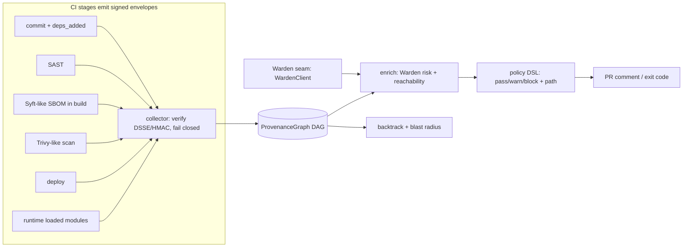

# TRACEGATE

**A provenance-aware CI/CD security gate.** TRACEGATE stitches signed per-stage pipeline events (commit, SAST, SBOM, image scan, deploy, runtime facts) into one content-addressed provenance DAG. With that graph it can:

- **gate** a PR with a deterministic pass/warn/block decision, where each reason is the graph path that caused it;
- **backtrack** a CVE or package to the commit, PR, author and build that introduced it;
- report the **blast radius** of a dependency or base-image layer (which images, services and containers inherit it);
- **triage by reachability**: a critical CVE in a module no running container loads is downgraded from block to warn, and the evidence is attached.

It fails closed. An unsigned, forged or tampered attestation blocks the gate, and so does a missing required stage.

## Architecture



Graph shape: `commit -> file`, `commit -introduced-> dependency -installed_in-> layer -layer_of-> image`, `commit -> build -> image -> deployment -> container`. Node ids are content-addressed (`kind:sha256:...`, where dependencies are keyed by purl). The same artifact seen by the manifest, Syft and Trivy therefore becomes a single node, and a shared base layer is a single node across every image.

| Module | File |
| --- | --- |
| Typed contracts | `tracegate/models.py` |
| Content addressing | `tracegate/ids.py` |
| Signing / verification (DSSE PAE + HMAC; cosign seam) | `tracegate/signing.py` |
| Provenance DAG (in-memory; Neo4j seam) | `tracegate/graph.py` |
| Collector | `tracegate/collector.py` |
| Warden connector (`WardenClient` protocol, heuristic + HTTP) | `tracegate/warden.py` |
| Enrichment (Warden risk, reachability) | `tracegate/enrich.py` |
| Policy gate (Python DSL) | `tracegate/policy.py` |
| Backtracker / blast radius | `tracegate/backtrack.py` |
| Synthetic event generator | `tracegate/synth.py` |
| CLI | `tracegate/cli.py` |

## Quickstart

Runtime needs only the Python 3.10+ standard library; `pytest` is needed only for the tests.

```bash
pip install pytest
make test          # 20 tests
make demo          # runs all 6 scenarios
make bench         # synthetic scale benchmark

python -m tracegate.cli synth cve-origin ev.json
python -m tracegate.cli gate ev.json --comment      # exit 1 on block
python -m tracegate.cli backtrack ev.json CVE-2020-14343
python -m tracegate.cli blast ev.json sha256:<base-layer-prefix>
```

Demo scenarios (they follow the spec): `clean` (pass), `malicious-dep` (a typosquat is blocked, with the commit -> dependency path), `cve-origin` (a reachable CVE is blocked and the origin story names PR #42 and 3 services), `unreachable` (a critical CVE that is not loaded is downgraded to warn), `tampered` (a forged scan attestation blocks), `unsigned-missing` (a missing stage blocks). The base-layer blast radius is printed during the `clean` scenario.

Set `TRACEGATE_KEYID` and `TRACEGATE_KEY` to use a real key. The built-in demo key exists only for demos.

## Warden integration

TRACEGATE does not re-implement dependency-risk scoring. Any object that has `score(name, version) -> WardenScore` works. `HttpWardenClient` calls `GET {warden}/score?package=&version=` and expects a response of the form `{risk, reasons}`. That response shape is an assumed contract, so adjust it to match the real Warden API. `HeuristicWarden` is an offline typosquat stand-in used for tests.

## Prior art and how this differs

| Tool | What it does | TRACEGATE |
| --- | --- | --- |
| Syft | Generates SBOMs | Consumes Syft-shaped SBOMs as one input |
| Trivy / Grype | Scans per artifact | Attaches their findings to graph nodes and adds lineage |
| Sigstore / SLSA / in-toto | Attestation formats and verification | Uses a DSSE-style envelope; the contribution is the queryable graph built on top |
| Snyk / GHAS | Commercial suites | Open, and gives one graph you can query across stages |

What is not novel: SBOMs, scanning and attestation. TRACEGATE's part is the integration: the graph, finding -> commit backtracking, and reachability-aware gating.

## Status / TODO (Grade C/D/E, not built)

- [ ] Real cosign / in-toto signing (Sigstore keyless). The MVP uses shared-key HMAC behind the `Verifier` seam.
- [ ] Neo4j persistence adapter. The graph is currently in-memory.
- [ ] Ingesting raw Syft / Trivy JSON unchanged from real runs. The collector accepts a documented subset, and adapters are still to be written.
- [ ] Real runtime facts (eBPF, `/proc/*/maps`, Python import hooks). Reachability currently comes from `loaded_modules` events, and it is module-level only, not function-level.
- [ ] Real Warden API contract. The current one is assumed.
- [ ] OPA/Rego policy backend, FastAPI service, React lineage UI, GitHub PR-comment bot.
- [ ] Demo monorepo with a real GitHub Actions pipeline, EPSS prioritisation, commit-risk model.

## Safety

This is a defensive tool. It only reads pipeline metadata that you produce. All demo data is synthetic, and CVE ids appear only as labels. Nothing in this repo scans or touches third-party systems. See `THREAT_MODEL.md` and `SECURITY.md`.
