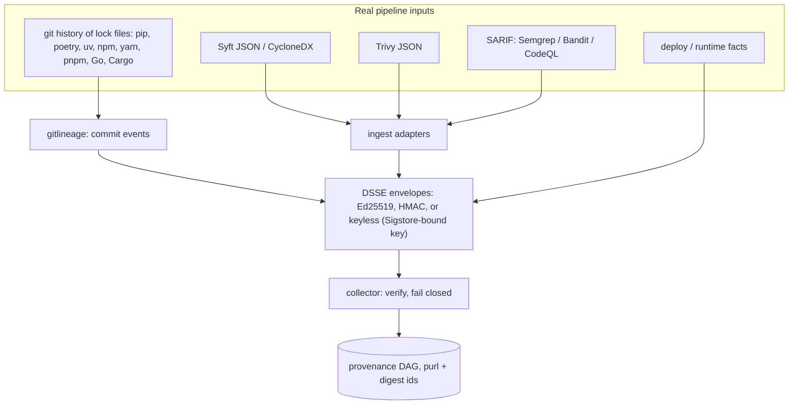
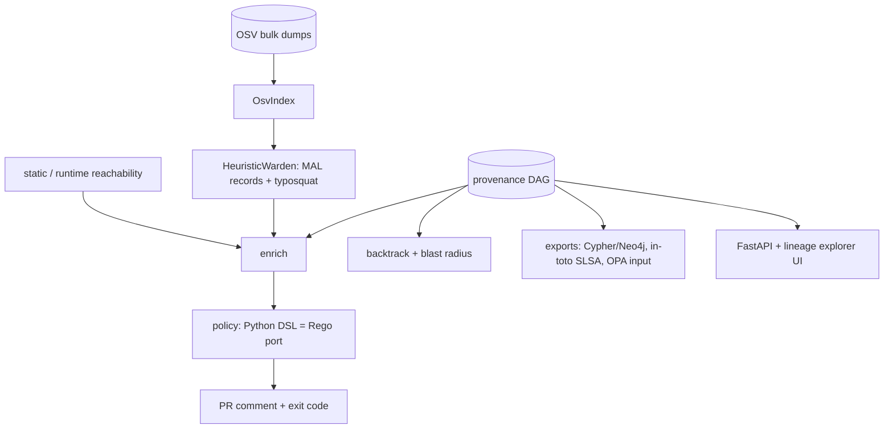

# TRACEGATE

[](https://github.com/rakshit-737/tracegate/actions/workflows/ci.yml)

[](https://rakshit-737.github.io/tracegate/)
[](LICENSE)


**TRACEGATE attributes every scanner finding to the commit and PR that introduced the vulnerable version by version-aware diffing of lock-file history, inside a fail-closed, signature-verified CI gate. Across 11 repos and 4 ecosystems it agrees with `git blame` on 88.8% of findings (agreement, not correctness: blame shares the pin parser); against an independent oracle of 231 single-package bot bumps re-checked at later snapshots it is right on 243/243 at the bump (blame 99.2%) and 231/231 at later snapshots (blame 94.8%; exact lower 95% bound 98.7%), which tests version tracking under line rewrites rather than attribution independent of the pin parser, and on Cargo and npm lock files it is far closer to blame than an exact-pin `git log -S` pickaxe (Cargo 95.0% vs 54.7%, npm 83.9% vs 70.6%); on pip and Go the one-line pickaxe matches blame exactly and slightly outperforms TRACEGATE (TRACEGATE 97.8% / 99.7%).** ([Evaluation](https://rakshit-737.github.io/tracegate/evaluation/))

[](https://rakshit-737.github.io/tracegate/demo/)

**Docs:** https://rakshit-737.github.io/tracegate/ · [live demo](https://rakshit-737.github.io/tracegate/demo/) · [how it works](https://rakshit-737.github.io/tracegate/how-it-works/)

## Try it in 60 seconds

1. **Zero install:** open the [live demo](https://rakshit-737.github.io/tracegate/demo/). The `cve-origin` scenario loads with a BLOCK verdict; type `CVE-2020-14343` and press Enter to see the origin story (PR #42) and the blast radius.
2. **From source** (v1.1.0 or later; do not `pip install tracegate`: that PyPI name belongs to an unrelated project):

   ```bash
   python -m venv .venv && . .venv/bin/activate        # Windows: .venv\Scripts\activate (Git Bash: . .venv/Scripts/activate)
   pip install "git+https://github.com/rakshit-737/tracegate@v1.1.0"
   tracegate demo                                      # six scenarios, about 2 seconds
   tracegate synth cve-origin ev.json
   tracegate --demo backtrack ev.json CVE-2020-14343   # "introduced_by": {"pr": 42, ...}
   tracegate --demo gate ev.json --comment             # "## TRACEGATE: BLOCK", exit 1
   ```

   `--demo` (accepted before or after the subcommand) trusts the public demo key. Without a configured key the gate refuses to run (exit 2). The v1.0.0 release (wheel and `:1.0.0` image) predates both: it trusts the demo key implicitly (fail-open) and is superseded by v1.1.0.
3. **Container (build from source):** `docker build -t tracegate . && docker run --rm -p 127.0.0.1:8080:8080 tracegate`, then open http://127.0.0.1:8080 and run a scenario. Or pull `ghcr.io/rakshit-737/tracegate:1.1.0`; the `:1.0.0` image is the superseded fail-open build.

**TRACEGATE is a provenance-aware CI/CD security gate.** It merges real Syft SBOMs, Trivy scans, git history and OSV data into one signed, content-addressed provenance graph. It can then answer the question most scanners leave open: *which commit, and which PR, put this CVE in production, and what else inherits it?*

- **Gate.** Every PR gets a deterministic pass/warn/block verdict. Each reason is the graph path that produced it (commit -> dependency -> layer -> image -> service).
- **Backtrack.** Takes a CVE or package and returns the commit, PR, author and build that introduced it.
- **Blast radius.** Lists every image, service and container that inherits a vulnerable dependency or base layer.
- **Reachability triage.** A critical CVE in a package the app never imports or loads is downgraded from block to warn, with the evidence attached.
- **Fail closed.** The gate blocks on an unsigned, forged or tampered attestation and on a missing required stage, and refuses to run with no trust root configured. In CI the signing key can be bound to the workflow identity with Sigstore keyless signing.

---

## Headline results (real public data)

All numbers come from the committed runs in [`results/`](results/), produced by the [`benchmarks` workflow](https://github.com/rakshit-737/tracegate/actions/runs/37003433022) on a GitHub runner. Methodology, every table and confidence interval: [Evaluation](https://rakshit-737.github.io/tracegate/evaluation/). Commands: [Reproduce](https://rakshit-737.github.io/tracegate/reproduce/).

| Question | Data | TRACEGATE | Baselines |
| --- | --- | --- | --- |
| Finding -> introducing commit (agreement with `git blame --first-parent`) | 3,203 vulnerable pin-snapshot pairs, 132 snapshots of 11 repos, 4 ecosystems | **88.8%** [Wilson 87.7-89.8; repo-clustered bootstrap 79.0-97.5; per-repo range 62-100%] | exact-pin `git log -S`: 74.5%; last manifest commit: 14.3%; first pickaxe mention: 14.9% |
| ... per ecosystem | pip 362 / Go 328 / Cargo 483 / npm 2,030 pairs | 97.8% / 99.7% / **95.0%** / **83.9%** | exact-pin `git log -S`: 100% / 100% / 54.7% / 70.6% |
| Finding -> introducing commit, **independent oracle** (bot single-package bumps, label from the commit subject, not from the parser or blame) | 243 bumps in 10 repos, scored at the bump and at the last later snapshot still pinning it | **231/231** at later snapshots (100%) | `git blame` 219/231 (94.8%); exact-pin `git log -S` 197/231 (85.3%) |
| Reachability: high/critical findings left actionable | 887 high+ OSV findings, 36 snapshots of 3 Python repos, each analysed against its own sources | 836 (**-5.7%**); the 51 downgrades are not audited, so the false-unreached rate is unmeasured | 887 (raw scanner output) |
| Typosquat, PyPI (hash split, test half) | 5,964 OSV `MAL-*` names vs 4,973 packages ranked 5k-15k | F1 0.133 at the dev-tuned default (FPR 1.7%); 0.153 at FPR 3.2% with the threshold matched to Damerau-1's FPR on the dev half (paired F1 vs Damerau-1: +0.007 [+0.002, +0.011]) | Damerau-1 0.147; typomania/TypoGard 0.125 (port matches the original typomania's flags on 100% of test names; original TypoGard script 0.121); our port of pypi-scan 0.112 |
| Keyless signing | wheel + sdist of this repo | signed with GitHub OIDC, verified, Rekor entries checked ([evidence](results/sigstore_evidence.json)) | - |
| Admission | kind cluster, 3 images | signed image Running; unsigned image denied by cosign; a cosign-valid image whose signed provenance lacks build/scan stages denied by the TRACEGATE gate ([decisions](results/kind_admission.json)) | cosign alone would admit the third image |
| Gate latency (median per repo) | real lineage graphs | 6-62 ms (pip), 36-110 ms (Cargo), 99-440 ms (npm), 290 ms (Go); max 893 ms | - |

What the numbers mean, stated plainly:

- **On pip and Go manifests, backtracking is not better than a one-line `git log -S` on the exact pin line** (both near 100%; blame and pickaxe are nearly the same algorithm). TRACEGATE's version-aware diff only wins on **lock files whose lines get rewritten without a version change**: Cargo.lock (95.0% vs 54.7%) and npm/yarn/pnpm locks (83.9% vs 70.6%). It is weakest on vue-core (62%) and mastodon (78%), where one package name carries several versions and the parsers keep only one (a known limitation). The ground truth is line blame, so on rewritten lines it is itself debatable.
- **The reachability reduction is small and unaudited.** Earlier runs reported -15.1% / -25.8%; an audit showed most of those "unreached" packages were loaded (pycrypto via `Crypto`, paramiko, Pillow via Django `ImageField`). A mode that judged historical pins against today's sources still downgraded some of those same packages (pycrypto and paramiko in netbox, requests in healthchecks), so it is no longer reported. The remaining figure, -5.7%, analyses each snapshot against its own sources; its 51 downgrades (mostly transitive packages in warehouse: rsa, pyasn1, cbor2, pygments, pyyaml) have not been checked by hand, so the false-unreached rate is unknown and the figure is an upper bound on useful triage. There is no exploitability ground truth.
- **Typosquat recall is low for every detector** (most `MAL-*` names are spam or dependency confusion). The test sets are mostly malicious (PyPI 55%, npm 96%), so precision there is not deployment precision: at a 1% base rate TRACEGATE's precision would be about 3-4%. On a time split (tune before 2025, test after) every PyPI detector roughly halves (TRACEGATE F1 0.059 at the dev-tuned default, 0.083 FPR-matched, vs Damerau-1 0.066). On RubyGems, crates.io and NuGet no name-similarity detector is useful.

### Real images: what the gate sees

| Image | Syft pkgs | Layers | Trivy findings | Matched to SBOM node | Syft/Trivy SBOM Jaccard |
| --- | ---: | ---: | ---: | ---: | ---: |
| alpine:3.14.2 | 15 | 1 | 43 | 43 | 0.93 |
| httpd:2.4.49-alpine3.14 | 36 | 5 | 99 | 99 | 0.94 |
| memcached:1.6.10-alpine3.14 | 20 | 6 | 44 | 44 | 0.90 |
| nginx:1.21.3-alpine | 45 | 6 | 105 | 105 | 0.93 |
| node:14.17.6-alpine3.14 | 417 | 4 | 90 | 90 | 0.995 |
| python:3.9.7-alpine3.14 | 51 | 5 | 83 | 83 | 0.95 |
| redis:6.2.5-alpine3.14 | 19 | 6 | 43 | 43 | 0.89 |

When the 7 images are merged into one graph, the result has 538 nodes and 556 edges. The 507 per-image Trivy rows collapse into 215 unique finding nodes (142 unique CVEs), a 2.4x de-duplication. The gate verdict is `block`.

Warden (dependency-risk) scoring of the 401 language packages flags 3. One is `npm-cli-docs`: OSV has an all-versions MAL record for that public name, and npm bundles an internal package with the same name. The other two are typosquat-heuristic false positives on legitimate packages (`ansistyles`, `uid-number`). An earlier name-only MAL lookup flagged 13 more clean packages (`chalk 2.4.1`, `debug 3.1.0`, ...). The cause was the Sept-2025 npm hijack records, which list only the trojanised versions. The fix is covered in [ADR 0006](docs/adr/0006-version-aware-malicious-package-matching.md).

### Scale (synthetic, for graph growth only)

| Services | Deps | Events | Nodes | Edges | Gate median |
| ---: | ---: | ---: | ---: | ---: | ---: |
| 10 | 50 | 41 | 104 | 562 | 0.014 s |
| 50 | 100 | 201 | 354 | 5,302 | 0.17 s |
| 100 | 200 | 401 | 704 | 20,602 | 0.55 s |
| 200 | 400 | 801 | 1,404 | 81,202 | 1.63 s |

---

## Architecture

**1. Ingest, sign, verify**



**2. Enrich, decide, query**



Graph shape: `commit -introduced-> dependency -installed_in-> layer -layer_of-> image -> deployment -> container`, plus `commit -> build -> image`. Node ids are content-addressed. Dependencies are keyed by a canonical purl, so a package seen in the manifest, by Syft and by Trivy becomes **one** node, and a shared base layer is one node across every image ([ADR 0001](docs/adr/0001-content-addressed-identity.md)).

| Module | File | Notes |
| --- | --- | --- |
| Contracts, content addressing | `models.py`, `ids.py` | canonical purls, memoised |
| Signing | `signing.py` | DSSE PAE; Ed25519 (`cryptography`) or HMAC; in-toto v1 / SLSA statements |
| Collector | `collector.py` | verifies every envelope; missing or invalid provenance blocks |
| Real-tool ingest | `ingest.py` | Syft JSON, CycloneDX, Trivy JSON (unchanged tool output) |
| Git lineage | `gitlineage.py` | first-parent manifest walk, follows renames, PR numbers from subjects |
| OSV index | `osv.py` | offline, streams official zip dumps; ECOSYSTEM/SEMVER ranges; CVSS v3 |
| Typosquat / Warden | `typosquat.py`, `warden.py` | deletion-index edit distance, transposition, separator, homoglyph, suffix, combosquat; `MultiWarden` per ecosystem; `WardenApiClient` for the real Warden service |
| Reachability | `reach.py`, `enrich.py` | runtime facts first, static fallback ([ADR 0004](docs/adr/0004-reachability-runtime-first-static-fallback.md)) |
| Policy | `policy.py`, `policies/tracegate.rego` | deterministic; Rego parity checked in CI ([ADR 0003](docs/adr/0003-deterministic-policy-python-dsl-and-rego.md)) |
| Backtrack | `backtrack.py` | origin story + blast radius |
| Exports | `export.py` | Neo4j Cypher, JSON, OPA input, in-toto |
| Service | `api.py`, `ui/index.html` | FastAPI + dependency-free lineage explorer |

Reachability tiers: `imported` (AST imports and dotted strings), `entrypoint` (named in the Dockerfile, Procfile, CI or config), `transitive` (pip-compile `# via` edges, and implied framework dependencies such as `django.db.backends.postgresql` -> psycopg), `referenced` (bare string constants such as passlib's `"argon2"`), and `unreached`. Only `unreached` findings are downgraded.

---

## Development

```bash
git clone https://github.com/rakshit-737/tracegate && cd tracegate
pip install -e ".[dev]"            # the core gate is stdlib-only; extras add crypto/osv/api
python -m pytest -q                # about 100 tests; real-data tests skip without datasets
python -m tracegate.cli demo       # the six spec scenarios
```

Gate a real image scan with Ed25519-signed provenance:

```bash
tracegate keygen ~/.tracegate/ci          # keep keys outside the repo; the .key is written 0600
export TRACEGATE_KEYID=ci TRACEGATE_SIGNING_KEY=~/.tracegate/ci.key TRACEGATE_PUBKEY=~/.tracegate/ci.pub
syft  <image> -o syft-json=sbom.json
trivy image --format json -o trivy.json <image>
tracegate ingest --syft sbom.json --trivy trivy.json --commit $(git rev-parse HEAD) -o img.json
tracegate lineage . requirements.txt -o commits.json       # run inside an app repo with a pinned manifest
tracegate merge commits.json img.json -o events.json
tracegate gate events.json --comment                        # exit 1 on block
tracegate backtrack events.json CVE-2023-0465
tracegate export events.json --format intoto > provenance.intoto.json
tracegate export events.json --format cypher | cypher-shell -u neo4j -p ...
```

Service and UI: `tracegate --demo serve` starts the API with the lineage explorer at http://127.0.0.1:8080 and the built-in scenarios (public demo key). For a real gate give it a trust root, for example `TRACEGATE_KEYID=ci TRACEGATE_PUBKEY=~/.tracegate/ci.pub tracegate serve`; with no trust root it refuses to start (exit 2). Set `TRACEGATE_API_TOKEN` before exposing it beyond localhost. `NEO4J_PASSWORD=... TRACEGATE_PUBKEY_FILE=~/.tracegate/ci.pub docker compose up --build` adds Neo4j (localhost-only ports); compose refuses to start without `NEO4J_PASSWORD`.

Demo scenarios (these follow the spec):

| Scenario | Outcome |
| --- | --- |
| `clean` | pass; also prints the base-layer blast radius |
| `malicious-dep` | typosquat blocked, with the commit -> dependency path |
| `cve-origin` | reachable CVE blocked; the origin story names PR #42 and 3 services |
| `unreachable` | critical CVE in a module that is never loaded -> warn |
| `tampered` | forged scan attestation -> block (fail closed) |
| `unsigned-missing` | missing stage -> block |

---

## Datasets

Nothing large is committed. `scripts/download_data.py` fetches everything into `$TRACEGATE_DATA` (default: a sibling `../../datasets/tracegate` if present, else `./data/`, which is git-ignored) and records a sha256 and a timestamp for each file in `MANIFEST.json`. Tool binaries are verified against the release checksums. The OSV dumps, popularity lists and blobless clones take about 1 GB; Syft, Trivy and the Trivy vulnerability DB (only for the image benchmark) add about 1.7 GB.

| Data | Source | Size | Licence |
| --- | --- | --- | --- |
| OSV bulk dumps: PyPI, npm, Alpine (includes ossf/malicious-packages `MAL-*`) | `osv-vulnerabilities.storage.googleapis.com` | 244 MB | per source: OSV/GHSA/PyPA data CC-BY-4.0, malicious-packages Apache-2.0 |
| Top PyPI packages (30-day downloads) | hugovk/top-pypi-packages | 1 MB | see upstream repo |
| npm high-impact list | wooorm/npm-high-impact | <1 MB | MIT |
| Git history: healthchecks, netbox, pypi/warehouse (blobless clones) | GitHub | 79 MB | BSD-3 / Apache-2.0 / Apache-2.0 |
| 7 pinned official Docker images (pulled as data, sha256-verified, **never run**) | Docker Hub | 283 MB | per image |
| Syft 1.52.0, Trivy 0.74.0 binaries + Trivy DB | anchore/syft, aquasecurity/trivy | ~1.7 GB | Apache-2.0 |

Small fixtures derived from real tool output (`tests/fixtures/alpine.syft.json`, `alpine.trivy.json`, `osv_sample.json`) keep CI independent of the downloads.

## Reproducibility

The full-data runs execute in the `benchmarks` workflow; the [Reproduce](https://rakshit-737.github.io/tracegate/reproduce/) page lists expected outputs and runtimes. Locally, each step is a single command:

```bash
python scripts/download_data.py all      # make data   (OSV, popularity lists, tools, repos)
trivy image --download-db-only --cache-dir <data>/trivy-cache   # Trivy vuln DB (not fetched by the script)
python scripts/scan_real.py all          # make scans  (real Syft + Trivy over images and repos)
python benchmarks/typosquat_eval.py --eco PyPI npm RubyGems crates.io NuGet   # add --split time for the time split
python benchmarks/lineage_eval.py --snapshots 12   # -> results/lineage_real_repos.json
python benchmarks/lineage_eval.py --snapshots 12 --materialize --repos healthchecks netbox warehouse
python benchmarks/images_eval.py         # -> results/images_real.json
python benchmarks/scale_eval.py          # -> results/scale_synthetic.json
python -m pytest -q -m realdata          # real-data tests (need the datasets)
```

OSV dumps, popularity lists and the Trivy DB are live feeds, so a re-run on a later date can shift finding counts and typosquat numbers; the sha256 of what was used is in `results/data_manifest.json`. Re-running `images_eval.py` on the same data reproduced every count in `results/images_real.json` exactly (only latency changed).

Evaluation design, including the splits, ground truth and why download counts are *not* used as a typosquat feature, is in [ADR 0005](docs/adr/0005-real-data-evaluation-design.md).

---

## Prior art and how this differs

| Tool | What it does | TRACEGATE |
| --- | --- | --- |
| Syft | SBOM generation | consumes its unmodified JSON as the build/layer stage |
| Trivy / Grype | per-artifact vuln scanning | attaches findings to shared graph nodes and adds commit lineage and blast radius |
| Sigstore / SLSA / in-toto | attestation formats and verification | emits DSSE + in-toto SLSA statements; its contribution is the queryable graph on top |
| GUAC (OpenSSF) | supply-chain metadata graph | GUAC is a large multi-service aggregator; TRACEGATE is a stdlib-only CI gate with deterministic verdicts and commit-level backtracking |
| Snyk / GitHub Advanced Security | commercial suites | open source, and gives one graph you can query across stages |
| typomania / TypoGard (Taylor et al., NSS 2020), pypi-scan | name similarity | original typomania and TypoGard code run on the same splits in CI (port agreement 98.99-100%); pypi-scan is our port (see Evaluation) |

SBOMs, scanning and attestation formats are not novel. The contribution is retroactive, version-aware attribution of findings to introducing commits on lock-file history (measured as agreement with `git blame`, not correctness: it beats an exact-pin pickaxe on Cargo and npm locks, and the pickaxe is slightly better on pip and Go), delivered inside a fail-closed, signed gate. Cross-tool identity, reachability and typosquat scoring are supporting components.

## Limitations

- **Reachability is static and at module level.** Runtime facts are supported as events, but no eBPF or `/proc/*/maps` collector ships. Per-snapshot source materialisation is available in the lineage benchmark (`--materialize`); dynamic imports, plugins loaded by name from settings, and C-extension loading are still invisible.
- **Reachability reductions have only a manual false-negative audit.** There is no public ground truth for "exploitable in this app"; an audit of the earlier run found packages the apps do load marked `unreached` (fixed rules are listed in the CHANGELOG). Static downgrades must not be trusted on untrusted PRs.
- **Lock-file parsers keep one version per package name.** yarn, pnpm, npm and Cargo locks that hold several versions of one package (7-14% of entries on the real lock files we checked) contribute only one of them, so the others are never matched against OSV or attributed. go.sum is used as published; go.mod is authoritative for Go.
- **Keyless signing covers the CI key, not each envelope.** CI signs an ephemeral Ed25519 public key with Sigstore (Fulcio + Rekor) and the gate verifies that bundle with `cosign`; envelopes themselves are Ed25519. The kind admission demo is a gate step before `kubectl apply`, not an in-cluster validating webhook.
- **Warden integration is contract-tested only.** `WardenApiClient` follows the real Warden `POST /api/v1/scans` schema, but no end-to-end run against a live Warden is in CI; offline results use `HeuristicWarden`.
- **Typosquat recall is low in absolute terms** (see above). Treat it as one signal, not a malware detector.
- **SAST comes in as SARIF 2.1.0** (`tracegate ingest --sarif`, tested on Bandit-style fixtures). SAST findings are attached to files, not to dependencies, so reachability does not apply to them.
- Image deployments in the image benchmark are synthetic (one service per image).
- **Bot-bump oracle is a capped convenience sample.** At most 40 bumps per repo are evaluated (warehouse, hugo, bat, excalidraw and mastodon hit the cap); ripgrep and alacritty contribute one case each and netbox none. For a single-package bump the oracle label and TRACEGATE's answer are close to the same event, so the oracle tests version tracking under line rewrites, not attribution when lines are reformatted; multi-package bumps, reverts and re-bumps are not yet in it. The repo-clustered bootstrap for 231/231 is degenerate; the one-sided Clopper-Pearson 95% lower bound is about 98.7%.
- **Pooled 88.8% is an implementation figure.** It includes the one-version-per-name parser limitation above, which depresses vue-core (pnpm) and mastodon (yarn); it is not a pure property of the method.
- **Some result files lack a run id.** `data_manifest.json`, `scale_synthetic.json` and `images_real.json` were generated locally.
- **Docs build is two steps.** Run `python scripts/build_static_demo.py` before `mkdocs build --strict`, or the demo ships without data (docs.yml does this).

## Roadmap

- eBPF / `sys.modules` runtime collector (needs a Linux runtime; not feasible on the Windows dev machine).
- Multi-version lock-file pins and an in-cluster validating admission webhook.
- Sigstore DSSE signing of each envelope (sigstore-python) instead of a Sigstore-bound key.
- Neo4j live adapter (currently Cypher export) and a React lineage explorer.
- EPSS-based prioritisation and a GitHub App for PR comments.

## Safety

TRACEGATE is a defensive, lab-only tool. It reads pipeline metadata that you produce. Images are pulled as tarballs, unpacked with path and link sanitisation, and catalogued; they are never executed. No malware is downloaded. Malicious packages are known only by name and OSV record. Nothing in this repo scans third-party systems. See [THREAT_MODEL.md](THREAT_MODEL.md) and [SECURITY.md](SECURITY.md).

## Contributing and licence

See [CONTRIBUTING.md](CONTRIBUTING.md) and [CHANGELOG.md](CHANGELOG.md). Design decisions are in [docs/adr](docs/adr). MIT licensed; see [LICENSE](LICENSE).
