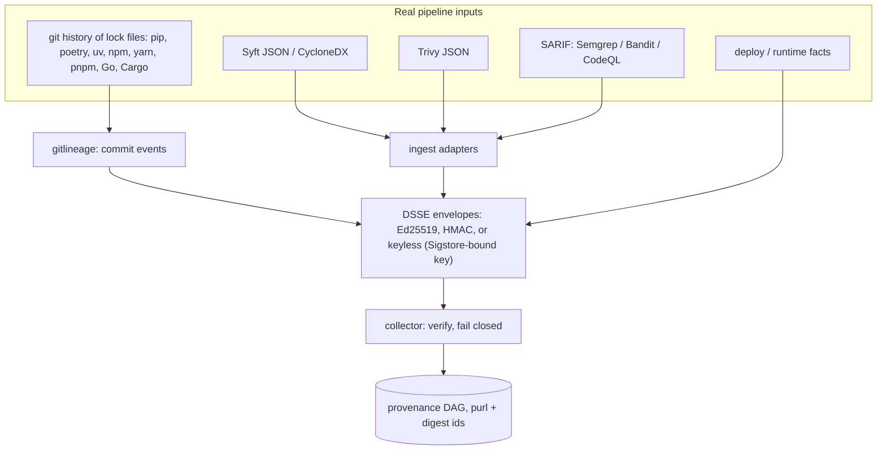
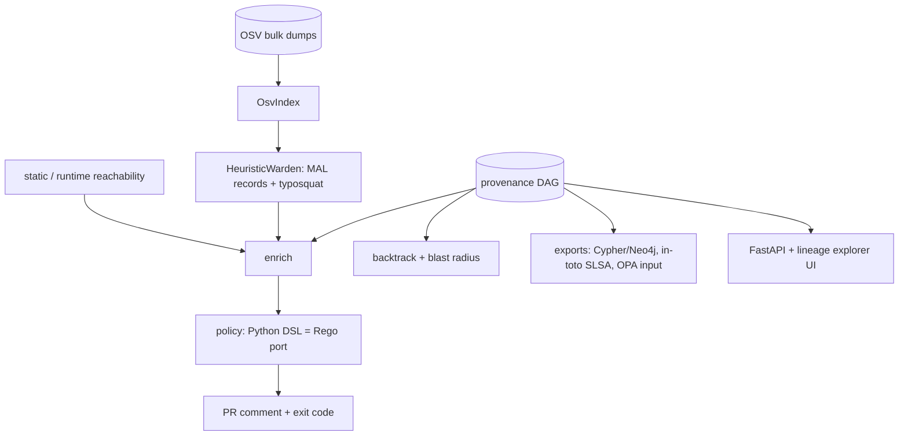

# Architecture

**1. Ingest, sign, verify**

**2. Enrich, decide, query**

Graph shape: `commit -introduced-> dependency -installed_in-> layer -layer_of-> image -> deployment -> container`, plus `commit -> build -> image`. Node ids are content-addressed. Dependencies are keyed by a canonical purl, so a package seen in the manifest, by Syft and by Trivy becomes **one** node, and a shared base layer is one node across every image ([ADR 0001](adr/0001-content-addressed-identity.md)).

| Module | File | Notes |
| --- | --- | --- |
| Contracts, content addressing | `models.py`, `ids.py` | canonical purls, memoised |
| Signing | `signing.py` | DSSE PAE; Ed25519 (`cryptography`) or HMAC; in-toto v1 / SLSA statements |
| Collector | `collector.py` | verifies every envelope; missing or invalid provenance blocks |
| Real-tool ingest | `ingest.py` | Syft JSON, CycloneDX, Trivy JSON (unchanged tool output) |
| Git lineage | `gitlineage.py` | first-parent manifest walk, follows renames, PR numbers from subjects |
| OSV index | `osv.py` | offline, streams official zip dumps; ECOSYSTEM/SEMVER ranges; CVSS v3 |
| Typosquat / Warden | `typosquat.py`, `warden.py` | deletion-index edit distance, transposition, separator, homoglyph, suffix, combosquat; `MultiWarden` per ecosystem; `HttpWardenClient` seam |
| Reachability | `reach.py`, `enrich.py` | runtime facts first, static fallback ([ADR 0004](adr/0004-reachability-runtime-first-static-fallback.md)) |
| Policy | `policy.py`, `policies/tracegate.rego` | deterministic; Rego parity checked in CI ([ADR 0003](adr/0003-deterministic-policy-python-dsl-and-rego.md)) |
| Backtrack | `backtrack.py` | origin story + blast radius |
| Exports | `export.py` | Neo4j Cypher, JSON, OPA input, in-toto |
| Service | `api.py`, `ui/index.html` | FastAPI + dependency-free lineage explorer |

Reachability tiers: `imported` (AST imports and dotted strings), `entrypoint` (named in the Dockerfile, Procfile, CI or config), `transitive` (pip-compile `# via` edges, and implied framework dependencies such as `django.db.backends.postgresql` -> psycopg), `referenced` (bare string constants such as passlib's `"argon2"`), and `unreached`. Only `unreached` findings are downgraded.