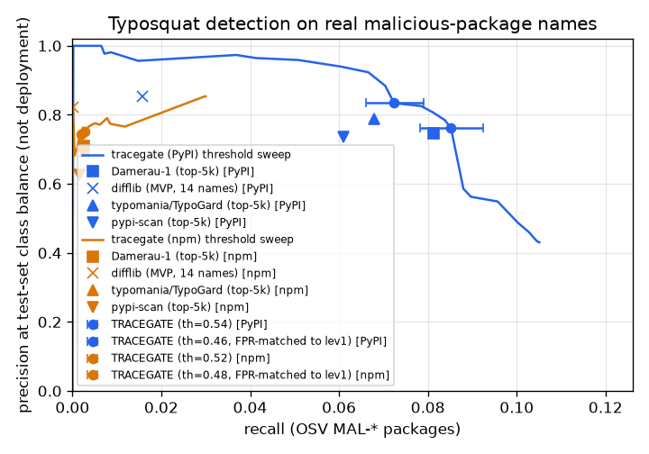

# Evaluation

Every number on this page is read from the committed JSON in [`results/`](https://github.com/rakshit-737/tracegate/tree/main/results), produced by the [`benchmarks` workflow run 36995342662](https://github.com/rakshit-737/tracegate/actions/runs/36995342662) on a GitHub `ubuntu-latest` runner. How to re-run it: [Reproduce](reproduce.md).

## Methodology

- **Backtracking.** For each repository, the first-parent history of its lock file is walked and 12 snapshots are spread evenly over it. At each snapshot the pins are matched against the offline OSV dump; for every vulnerable pin, TRACEGATE's answer (the commit whose diff introduced that version) is compared with `git blame --first-parent` on the pin's line. The unit is a (snapshot, vulnerable pin) pair, so one long-lived pin counts once per snapshot; pairs are clustered by repository, and the Wilson intervals below ignore that clustering, so they are too narrow; the per-repository spread (62% on vue-core to 100% on several pip and Go repos, table below) is the better guide to uncertainty. Baselines: the last commit that touched the manifest, the first `git log -G` mention of the package name, and the exact-pin pickaxe `git log --first-parent -1 -S'<pin line>'`. Blame and the exact-pin pickaxe are near-identical line-based algorithms (B-SZZ style; Sliwerski, Zimmermann and Zeller, MSR 2005), so they agree with the ground truth by construction on manifests whose lines change only when the version changes.
- **Reachability.** For the three Python repositories, every high/critical OSV finding is checked against static reachability (imports, entrypoints, `# via` edges, implied framework dependencies). Mode 1 analyses each snapshot against HEAD sources; mode 2 (`--materialize`) checks out each snapshot's own sources. No exploitability ground truth exists; see the audit note below.
- **Typosquat.** Positives are OSV `MAL-*` package names of the ecosystem that are not themselves popular; negatives are real packages ranked just below the reference list. Hash split: 50/50 by sha256(name), thresholds tuned on the dev half. The `FPR-matched` row picks the lowest threshold whose **dev** FPR is at most Damerau-1's dev FPR (no test data is used); the dev-tuned default (best dev F1 at dev FPR <= 2%) is shown beside it. Time split: positives first published before 2025-01-01 tune, later ones test (OSV `published` dates are dominated by bulk backfills); negatives stay hash-split. CIs are a seeded stratified bootstrap (1,000 resamples). Precision is also reported at 1% prevalence, because the test sets are mostly malicious.
- **Design notes** are in [ADR 0005](adr/0005-real-data-evaluation-design.md).

## Backtracking: finding -> introducing commit

| Repository | Ecosystem | Pairs | TRACEGATE | exact-pin `git log -S` | last manifest commit | first mention | gate median / max ms |
| --- | --- | ---: | ---: | ---: | ---: | ---: | ---: |
| healthchecks | pypi | 22 | 100.0% | 100.0% | 40.9% | 22.7% | 6 / 10 |
| netbox | pypi | 108 | 100.0% | 100.0% | 39.8% | 14.8% | 12 / 21 |
| warehouse | pypi | 234 | 96.6% | 100.0% | 6.0% | 4.7% | 62 / 554 |
| caddy | golang | 195 | 100.0% | 100.0% | 13.9% | 10.3% | 291 / 893 |
| hugo | golang | 133 | 99.2% | 100.0% | 9.8% | 6.8% | 290 / 773 |
| ripgrep | cargo | 72 | 97.2% | 68.1% | 11.1% | 13.9% | 36 / 76 |
| bat | cargo | 178 | 94.4% | 60.7% | 12.4% | 24.7% | 63 / 121 |
| alacritty | cargo | 233 | 94.8% | 45.9% | 3.0% | 21.9% | 110 / 227 |
| excalidraw | npm | 925 | 97.2% | 75.3% | 20.4% | 11.7% | 99 / 510 |
| mastodon | npm | 720 | 78.5% | 50.1% | 10.0% | 16.0% | 440 / 880 |
| vue-core | npm | 385 | 62.3% | 97.4% | 14.3% | 22.9% | 120 / 708 |
| **all** | 4 | 3205 | **88.8%** [87.7-89.8] | 74.5% [73.0-76.0] | 14.3% | 14.9% | |

| Ecosystem | Pairs | TRACEGATE | exact-pin `git log -S` |
| --- | ---: | ---: | ---: |
| pypi | 364 | 97.8% [95.7-98.9] | 100.0% [99.0-100.0] |
| golang | 328 | 99.7% [98.3-99.9] | 100.0% [98.8-100.0] |
| cargo | 483 | 95.0% [92.7-96.6] | 54.7% [50.2-59.0] |
| npm | 2030 | 83.9% [82.3-85.5] | 70.6% [68.6-72.5] |

Reading: on pip requirements and go.mod/go.sum the exact-pin pickaxe matches blame on every pair and TRACEGATE is slightly behind (pip: the 8 warehouse disagreements are merge commits and line rewrites without a version change). On Cargo.lock and npm-family lock files, lines are rewritten by unrelated updates, and version-aware diffing is far ahead of line-based attribution. vue-core (pnpm) and mastodon (yarn) are the weakest repositories: their lock files hold several versions of one package name and the parsers keep only one, so the commit TRACEGATE reports can belong to a different version than the line blame looks at. Go gate latency is the slowest per pin (median about 290 ms, max 893 ms). The earlier 3-repo result (97.5%, 356/365) is reproduced as 97.8% (356/364) with newer OSV data.

The scanner-only baseline is not measured: scanner output carries no commit, so it cannot attribute.

## Reachability

| Repository | high+ findings | actionable, HEAD sources | actionable, own sources |
| --- | ---: | ---: | ---: |
| healthchecks | 147 | 146 | 147 |
| netbox | 324 | 313 | 322 |
| warehouse | 424 | 345 | 375 |
| **all** | 895 | 804 (-10.2%) | 844 (-5.7%) |

Audit note: the previous release reported -15.1% (HEAD) and -25.8% (own sources). A manual audit found that most downgraded packages were loaded after all: `pycrypto` is imported as `Crypto`, `ecdsa`/`pycrypto` come in through paramiko, `lxml` through ncclient, `bleach` through readme_renderer, `mako` through alembic, and Django loads Pillow for `ImageField`. Those rules are now in `reach.py`. The HEAD-sources column is kept only for transparency and is **not** a headline figure: it judges historical pins against present-day code and still downgrades packages the audit showed were imported at those snapshots (netbox: CVE-2013-7459 / CVE-2018-6594 pycrypto==2.6.1, CVE-2018-1000805 / CVE-2018-7750 paramiko==1.15.2; healthchecks: CVE-2018-18074 requests==2.9.1). The reported figure is the own-sources column (-5.7%). Its 51 downgrades (netbox: pyyaml 3.11; warehouse: rsa, pyasn1, cbor2, pygments, bleach, httplib2, future, pyyaml) have not been audited, so the false-unreached rate is not measured; treat static downgrades as advisory. A published reference point with a different method and ecosystem: Pashchenko et al. (ESEM 2018) found about 20% of vulnerable dependencies of Java libraries are not deployed.

## Typosquat detection

Detectors: TRACEGATE (multi-technique, threshold tuned on dev), Damerau-1 (TRACEGATE's own `typo1` technique alone, top-5k reference), re-implementations of **typomania / TypoGard** (Rust Foundation port of Taylor et al., *Defending Against Package Typosquatting*, NSS 2020) and **pypi-scan** (IQT Labs), and the original 14-name difflib heuristic. The re-implementations live in `tracegate/baselines.py`; they were not validated against the original code, so every row labelled typomania/TypoGard or pypi-scan means *our port of* that tool. The TypoGard paper (arXiv 2003.03471v1, Section 4.3 "Signal Detection Rates") states that its signals "detected approximately 60% of known past attacks reported by the npm security team as typosquatting"; on the OSV labels here, where most names are not look-alikes, every detector's recall is far lower.

### PyPI, hash split

5964 test positives (313 labelled typosquat), 4973 test negatives; reference = top 5000.

| Detector | P | R | F1 [95% CI] | FPR | P at 1% prevalence | R on typo-labelled |
| --- | ---: | ---: | ---: | ---: | ---: | ---: |
| mvp-difflib (14 names) | 0.855 | 0.016 | 0.031 [0.025, 0.037] | 0.0032 | 0.048 | 0.067 |
| lev1 (top-5k) | 0.746 | 0.081 | 0.147 [0.135, 0.159] | 0.0332 | 0.024 | 0.137 |
| typomania/TypoGard (top-5k) | 0.788 | 0.068 | 0.125 [0.114, 0.136] | 0.0219 | 0.030 | 0.093 |
| pypi-scan (top-50) | 0.930 | 0.009 | 0.018 [0.013, 0.022] | 0.0008 | 0.101 | 0.029 |
| pypi-scan (top-5k) | 0.735 | 0.061 | 0.112 [0.101, 0.123] | 0.0263 | 0.023 | 0.128 |
| tracegate (th=0.54) | 0.834 | 0.072 | 0.133 [0.122, 0.145] | 0.0173 | 0.041 | 0.105 |
| tracegate (th=0.46, FPR-matched to lev1) | 0.762 | 0.085 | 0.153 [0.142, 0.165] | 0.0320 | 0.026 | 0.141 |

### PyPI, time split

2630 test positives (361 labelled typosquat), 4973 test negatives; reference = top 5000.

| Detector | P | R | F1 [95% CI] | FPR | P at 1% prevalence | R on typo-labelled |
| --- | ---: | ---: | ---: | ---: | ---: | ---: |
| mvp-difflib (14 names) | 0.673 | 0.013 | 0.025 [0.017, 0.033] | 0.0032 | 0.038 | 0.055 |
| lev1 (top-5k) | 0.365 | 0.036 | 0.066 [0.053, 0.078] | 0.0332 | 0.011 | 0.130 |
| typomania/TypoGard (top-5k) | 0.394 | 0.027 | 0.051 [0.039, 0.062] | 0.0219 | 0.012 | 0.100 |
| pypi-scan (top-50) | 0.867 | 0.010 | 0.019 [0.013, 0.027] | 0.0008 | 0.111 | 0.028 |
| pypi-scan (top-5k) | 0.385 | 0.031 | 0.058 [0.046, 0.070] | 0.0263 | 0.012 | 0.116 |
| tracegate (th=0.54) | 0.491 | 0.032 | 0.059 [0.047, 0.071] | 0.0173 | 0.018 | 0.116 |
| tracegate (th=0.46, FPR-matched to lev1) | 0.430 | 0.046 | 0.083 [0.068, 0.096] | 0.0320 | 0.014 | 0.161 |

### npm, hash split

109330 test positives (727 labelled typosquat), 4083 test negatives; reference = top 5000.

| Detector | P | R | F1 [95% CI] | FPR | P at 1% prevalence | R on typo-labelled |
| --- | ---: | ---: | ---: | ---: | ---: | ---: |
| mvp-difflib (14 names) | 0.821 | 0.000 | 0.000 [0.000, 0.001] | 0.0012 | 0.002 | 0.001 |
| lev1 (top-5k) | 0.711 | 0.003 | 0.005 [0.004, 0.006] | 0.0272 | 0.001 | 0.010 |
| typomania/TypoGard (top-5k) | 0.694 | 0.003 | 0.005 [0.005, 0.006] | 0.0316 | 0.001 | 0.008 |
| pypi-scan (top-50) | 0.846 | 0.000 | 0.000 [0.000, 0.000] | 0.0005 | 0.002 | 0.001 |
| pypi-scan (top-5k) | 0.626 | 0.002 | 0.003 [0.003, 0.004] | 0.0255 | 0.001 | 0.007 |
| tracegate (th=0.52) | 0.745 | 0.002 | 0.004 [0.003, 0.004] | 0.0176 | 0.001 | 0.010 |
| tracegate (th=0.48, FPR-matched to lev1) | 0.752 | 0.003 | 0.005 [0.005, 0.006] | 0.0240 | 0.001 | 0.011 |

### npm, time split

201706 test positives (1473 labelled typosquat), 4083 test negatives; reference = top 5000.

| Detector | P | R | F1 [95% CI] | FPR | P at 1% prevalence | R on typo-labelled |
| --- | ---: | ---: | ---: | ---: | ---: | ---: |
| mvp-difflib (14 names) | 0.896 | 0.000 | 0.000 [0.000, 0.001] | 0.0012 | 0.002 | 0.001 |
| lev1 (top-5k) | 0.798 | 0.002 | 0.004 [0.004, 0.005] | 0.0272 | 0.001 | 0.007 |
| typomania/TypoGard (top-5k) | 0.781 | 0.002 | 0.004 [0.004, 0.005] | 0.0316 | 0.001 | 0.008 |
| pypi-scan (top-50) | 0.917 | 0.000 | 0.000 [0.000, 0.000] | 0.0005 | 0.002 | 0.002 |
| pypi-scan (top-5k) | 0.739 | 0.002 | 0.003 [0.003, 0.003] | 0.0255 | 0.001 | 0.006 |
| tracegate (th=0.52) | 0.827 | 0.002 | 0.003 [0.003, 0.004] | 0.0176 | 0.001 | 0.009 |
| tracegate (th=0.48, FPR-matched to lev1) | 0.817 | 0.002 | 0.004 [0.004, 0.005] | 0.0240 | 0.001 | 0.011 |

### RubyGems, hash split

2086 test positives (0 labelled typosquat), 2479 test negatives; reference = top 5000.

| Detector | P | R | F1 [95% CI] | FPR | P at 1% prevalence | R on typo-labelled |
| --- | ---: | ---: | ---: | ---: | ---: | ---: |
| mvp-difflib (14 names) | 0.984 | 0.119 | 0.213 [0.191, 0.236] | 0.0016 | 0.430 | 0.000 |
| lev1 (top-5k) | 0.601 | 0.041 | 0.077 [0.062, 0.093] | 0.0230 | 0.018 | 0.000 |
| typomania/TypoGard (top-5k) | 0.341 | 0.014 | 0.027 [0.018, 0.037] | 0.0226 | 0.006 | 0.000 |
| pypi-scan (top-50) | 0.987 | 0.035 | 0.069 [0.054, 0.085] | 0.0004 | 0.473 | 0.000 |
| pypi-scan (top-5k) | 0.667 | 0.040 | 0.076 [0.061, 0.092] | 0.0169 | 0.024 | 0.000 |
| tracegate (th=0.54) | 0.739 | 0.039 | 0.075 [0.060, 0.091] | 0.0117 | 0.033 | 0.000 |
| tracegate (th=0.46, FPR-matched to lev1) | 0.626 | 0.042 | 0.078 [0.063, 0.095] | 0.0210 | 0.020 | 0.000 |

### RubyGems, time split

3430 test positives (0 labelled typosquat), 2479 test negatives; reference = top 5000.

| Detector | P | R | F1 [95% CI] | FPR | P at 1% prevalence | R on typo-labelled |
| --- | ---: | ---: | ---: | ---: | ---: | ---: |
| mvp-difflib (14 names) | 0.991 | 0.133 | 0.234 [0.216, 0.252] | 0.0016 | 0.456 | 0.000 |
| lev1 (top-5k) | 0.723 | 0.043 | 0.082 [0.069, 0.095] | 0.0230 | 0.019 | 0.000 |
| typomania/TypoGard (top-5k) | 0.495 | 0.016 | 0.031 [0.023, 0.039] | 0.0226 | 0.007 | 0.000 |
| pypi-scan (top-50) | 0.992 | 0.037 | 0.071 [0.059, 0.083] | 0.0004 | 0.481 | 0.000 |
| pypi-scan (top-5k) | 0.774 | 0.042 | 0.080 [0.067, 0.092] | 0.0169 | 0.025 | 0.000 |
| tracegate (th=0.58) | 0.910 | 0.038 | 0.074 [0.062, 0.086] | 0.0052 | 0.070 | 0.000 |
| tracegate (th=0.46, FPR-matched to lev1) | 0.743 | 0.044 | 0.083 [0.070, 0.096] | 0.0210 | 0.021 | 0.000 |

### crates.io, hash split

7 test positives (1 labelled typosquat), 2559 test negatives; reference = top 5000.

| Detector | P | R | F1 [95% CI] | FPR | P at 1% prevalence | R on typo-labelled |
| --- | ---: | ---: | ---: | ---: | ---: | ---: |
| mvp-difflib (14 names) | 0.333 | 0.143 | 0.200 [0.000, 0.545] | 0.0008 | 0.643 | 1.000 |
| lev1 (top-5k) | 0.011 | 0.143 | 0.021 [0.000, 0.065] | 0.0348 | 0.040 | 1.000 |
| typomania/TypoGard (top-5k) | 0.014 | 0.143 | 0.026 [0.000, 0.080] | 0.0274 | 0.050 | 1.000 |
| pypi-scan (top-50) | 0.500 | 0.143 | 0.222 [0.000, 0.600] | 0.0004 | 0.783 | 1.000 |
| pypi-scan (top-5k) | 0.015 | 0.143 | 0.027 [0.000, 0.085] | 0.0254 | 0.054 | 1.000 |
| tracegate (th=0.68) | 0.250 | 0.143 | 0.182 [0.000, 0.533] | 0.0012 | 0.546 | 1.000 |
| tracegate (th=0.48, FPR-matched to lev1) | 0.015 | 0.143 | 0.027 [0.000, 0.083] | 0.0262 | 0.052 | 1.000 |

### crates.io, time split

15 test positives (6 labelled typosquat), 2559 test negatives; reference = top 5000.

| Detector | P | R | F1 [95% CI] | FPR | P at 1% prevalence | R on typo-labelled |
| --- | ---: | ---: | ---: | ---: | ---: | ---: |
| mvp-difflib (14 names) | 0.500 | 0.133 | 0.210 [0.000, 0.455] | 0.0008 | 0.627 | 0.333 |
| lev1 (top-5k) | 0.011 | 0.067 | 0.019 [0.000, 0.062] | 0.0348 | 0.019 | 0.167 |
| typomania/TypoGard (top-5k) | 0.014 | 0.067 | 0.023 [0.000, 0.077] | 0.0274 | 0.024 | 0.167 |
| pypi-scan (top-50) | 0.500 | 0.067 | 0.118 [0.000, 0.333] | 0.0004 | 0.627 | 0.167 |
| pypi-scan (top-5k) | 0.015 | 0.067 | 0.025 [0.000, 0.083] | 0.0254 | 0.026 | 0.167 |
| tracegate (th=0.68) | 0.250 | 0.067 | 0.105 [0.000, 0.316] | 0.0012 | 0.360 | 0.167 |
| tracegate (th=0.48, FPR-matched to lev1) | 0.015 | 0.067 | 0.024 [0.000, 0.081] | 0.0262 | 0.025 | 0.167 |

### NuGet, hash split

377 test positives (0 labelled typosquat), 1509 test negatives; reference = top 1000.

| Detector | P | R | F1 [95% CI] | FPR | P at 1% prevalence | R on typo-labelled |
| --- | ---: | ---: | ---: | ---: | ---: | ---: |
| mvp-difflib (14 names) | 0.111 | 0.003 | 0.005 [0.000, 0.016] | 0.0053 | 0.005 | 0.000 |
| lev1 (top-5k) | 0.000 | 0.000 | 0.000 [0.000, 0.000] | 0.0040 | 0.000 | 0.000 |
| typomania/TypoGard (top-5k) | 0.000 | 0.000 | 0.000 [0.000, 0.000] | 0.0080 | 0.000 | 0.000 |
| pypi-scan (top-50) | 0.000 | 0.000 | 0.000 [0.000, 0.000] | 0.0000 | 0.000 | 0.000 |
| pypi-scan (top-5k) | 0.000 | 0.000 | 0.000 [0.000, 0.000] | 0.0027 | 0.000 | 0.000 |
| tracegate (th=0.56) | 0.000 | 0.000 | 0.000 [0.000, 0.000] | 0.0027 | 0.000 | 0.000 |
| tracegate (th=0.54, FPR-matched to lev1) | 0.000 | 0.000 | 0.000 [0.000, 0.000] | 0.0027 | 0.000 | 0.000 |

### NuGet, time split

44 test positives (0 labelled typosquat), 1509 test negatives; reference = top 1000.

| Detector | P | R | F1 [95% CI] | FPR | P at 1% prevalence | R on typo-labelled |
| --- | ---: | ---: | ---: | ---: | ---: | ---: |
| mvp-difflib (14 names) | 0.273 | 0.068 | 0.109 [0.000, 0.226] | 0.0053 | 0.115 | 0.000 |
| lev1 (top-5k) | 0.000 | 0.000 | 0.000 [0.000, 0.000] | 0.0040 | 0.000 | 0.000 |
| typomania/TypoGard (top-5k) | 0.000 | 0.000 | 0.000 [0.000, 0.000] | 0.0080 | 0.000 | 0.000 |
| pypi-scan (top-50) | 0.000 | 0.000 | 0.000 [0.000, 0.000] | 0.0000 | 0.000 | 0.000 |
| pypi-scan (top-5k) | 0.000 | 0.000 | 0.000 [0.000, 0.000] | 0.0027 | 0.000 | 0.000 |
| tracegate (th=0.48) | 0.100 | 0.045 | 0.062 [0.000, 0.156] | 0.0119 | 0.037 | 0.000 |
| tracegate (th=0.54, FPR-matched to lev1) | 0.333 | 0.045 | 0.080 [0.000, 0.192] | 0.0027 | 0.145 | 0.000 |

### Single-technique ablation (PyPI, hash split, default threshold)

| Technique alone | R | FPR | F1 |
| --- | ---: | ---: | ---: |
| separator | 0.000 | 0.0004 | 0.000 |
| homoglyph | 0.000 | 0.0004 | 0.000 |
| typo1 | 0.070 | 0.0165 | 0.130 |
| typo2 | 0.001 | 0.0004 | 0.001 |
| reorder | 0.000 | 0.0000 | 0.001 |
| combosquat | 0.000 | 0.0000 | 0.001 |
| suffix | 0.002 | 0.0004 | 0.003 |
| brandjack | 0.000 | 0.0000 | 0.000 |

Edit distance 1 (`typo1`) carries almost all of the signal; the other techniques add a fraction of a point of recall. On this data TRACEGATE is close to a scored Damerau-1 check, which is why typosquat detection is a supporting component, not the novelty claim.

## Signing and admission

- [`results/sigstore_evidence.json`](https://github.com/rakshit-737/tracegate/blob/main/results/sigstore_evidence.json): wheel and sdist signed keylessly with the `sigstore` workflow's GitHub OIDC identity; each Rekor entry fetched by logIndex and checked to record the artefact's sha256.
- [`results/kind_admission.json`](https://github.com/rakshit-737/tracegate/blob/main/results/kind_admission.json): in a kind cluster the signed image is admitted and Running; the unsigned one is denied by cosign (`no signatures found`); a third image with a valid keyless signature but signed provenance missing the build and scan stages passes cosign and is denied by `tracegate gate` (`missing signed provenance for stages ['build', 'scan']`).

## Real images: what the gate sees

| Image | Syft pkgs | Layers | Trivy findings | Matched to SBOM node | Syft/Trivy SBOM Jaccard |
| --- | ---: | ---: | ---: | ---: | ---: |
| alpine:3.14.2 | 15 | 1 | 43 | 43 | 0.93 |
| httpd:2.4.49-alpine3.14 | 36 | 5 | 99 | 99 | 0.94 |
| memcached:1.6.10-alpine3.14 | 20 | 6 | 44 | 44 | 0.90 |
| nginx:1.21.3-alpine | 45 | 6 | 105 | 105 | 0.93 |
| node:14.17.6-alpine3.14 | 417 | 4 | 90 | 90 | 0.995 |
| python:3.9.7-alpine3.14 | 51 | 5 | 83 | 83 | 0.95 |
| redis:6.2.5-alpine3.14 | 19 | 6 | 43 | 43 | 0.89 |

When the 7 images are merged into one graph, the result has 538 nodes and 556 edges. The 507 per-image Trivy rows collapse into 215 unique finding nodes (142 unique CVEs), a 2.4x de-duplication. The gate verdict is `block`.

Warden (dependency-risk) scoring of the 401 language packages flags 3. One is `npm-cli-docs`: OSV has an all-versions MAL record for that public name, and npm bundles an internal package with the same name. The other two are typosquat-heuristic false positives on legitimate packages (`ansistyles`, `uid-number`). An earlier name-only MAL lookup flagged 13 more clean packages (`chalk 2.4.1`, `debug 3.1.0`, ...). The cause was the Sept-2025 npm hijack records, which list only the trojanised versions. The fix is covered in [ADR 0006](adr/0006-version-aware-malicious-package-matching.md).

## Scale (synthetic, for graph growth only)

| Services | Deps | Events | Nodes | Edges | Gate median |
| ---: | ---: | ---: | ---: | ---: | ---: |
| 10 | 50 | 41 | 104 | 562 | 0.014 s |
| 50 | 100 | 201 | 354 | 5,302 | 0.17 s |
| 100 | 200 | 401 | 704 | 20,602 | 0.55 s |
| 200 | 400 | 801 | 1,404 | 81,202 | 1.63 s |